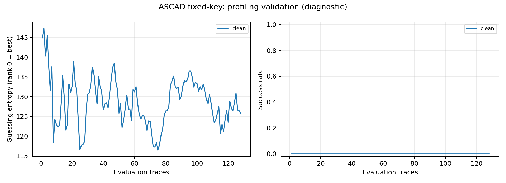

# Αναφορά πρώτης συνεδρίας — 3 Οκτωβρίου 2026

Το project διαθέτει λειτουργικό και ελεγμένο pipeline Python/PyTorch, πραγματικό ASCAD
dataset με επαληθευμένο checksum, αρχική βιβλιογραφική χαρτογράφηση και έτοιμο Kaggle
notebook. Η συνεδρία ολοκλήρωσε την υποδομή και τον CPU pilot. Δεν έχει ακόμη εκτελεστεί
πλήρες baseline, σύγκριση augmentations ή εκπαίδευση στο Kaggle.

**Ενημέρωση πλάνου:** ο χρήστης ζήτησε ελάχιστες εκπαιδεύσεις/notebooks. Το νέο πλάνο
είναι ένα notebook και τέσσερα CNN trainings, 10k traces, seed0. Οι πρώτες 3 none epochs
ως benchmark επαναχρησιμοποιούνται στις 50 baseline epochs. Τα ιστορικά CPU αποτελέσματα
παρακάτω διατηρούν τον αρχικό κώδικα στα run snapshots· δεν επανεκτελέστηκαν λόγω αυτής της αλλαγής.

## Πλαίσιο και υλοποίηση

Υπάρχει ένα εξάμηνο μέχρι την παράδοση και δεν έχουν οριστεί επιπλέον κριτήρια μαθήματος.
Ο χρήστης επιβεβαίωσε πρόσβαση Kaggle GPU. Δεν έχει δοθεί ακριβής ημερομηνία ούτε ελεγχθεί
το προσωπικό GPU quota. Το laptop αναγνωρίστηκε ως Ryzen 5 7535HS με 12 logical CPUs·
χρησιμοποιήθηκαν 2 PyTorch threads. Τα 16 GB RAM είναι πληροφορία του χρήστη.

Δημιουργήθηκε απομονωμένο `.venv` με Python 3.12.14 και PyTorch 2.8.0+cpu. Οι βασικές
εκδόσεις είναι numpy 2.2.6, h5py 3.14.0, matplotlib 3.10.5 και pytest 8.4.2·
το [CPU freeze](../requirements-lock-cpu.txt) καταγράφει την πραγματική εγκατάσταση.
Το `pip check` ολοκληρώθηκε χωρίς ασύμβατες εξαρτήσεις. Δεν απαιτούνται API keys ή πληρωμένες υπηρεσίες.

Ο κοινός κώδικας στο `src/sca` καλύπτει:

- HDF5 inspection, επαλήθευση labels, χωριστά training/validation/attack loaders.
- Training-only κανονικοποίηση, αποθηκευμένα indices και ταυτότητα splits.
- Μικρό MLP και 1D CNN με 256 identity classes για το zero-based byte index 2.
- Online Gaussian noise, μη κυκλικά shifts και συνδυασμό τους, χωρίς επιπλέον batches.
- Training με CPU/CUDA, checkpoints model/optimizer/epoch/RNG και ακριβή epoch-boundary resume.
- Numerically stable key ranking, zero-based conservative ties, GE/SR, censored failures,
  CSV/NPZ, πραγματικούς χρόνους και γραφήματα.
- Manifests με config, seed, dataset SHA-256, split ID, dependencies, συσκευή,
  code hash/Git state και πηγαίο snapshot ανά run.

Οι σταθερές οδηγίες είναι στο [AGENTS.md](../AGENTS.md), το σχέδιο εξαμήνου στο
[PROJECT_PLAN.md](../PROJECT_PLAN.md) και οι ακριβείς ορισμοί στο
[πειραματικό πρωτόκολλο](../docs/EXPERIMENT_PROTOCOL.md).

## Προέλευση και έλεγχος πραγματικών δεδομένων

Λήφθηκε το original synchronized ASCAD fixed-key `ASCAD.h5`, από το επίσημο archive
της 30ής Μαΐου 2018. Η [επίσημη campaign τεκμηρίωση](https://github.com/ANSSI-FR/ASCAD/blob/master/ATMEGA_AES_v1/ATM_AES_v1_fixed_key/Readme.md)
και ο [κώδικας παραγωγής](https://github.com/ANSSI-FR/ASCAD/blob/master/ASCAD_generate.py)
είναι οι αναφορές για έκδοση, checksum και labels.

| Έλεγχος | Πραγματικό αποτέλεσμα |
|---|---|
| Profiling traces | 50.000 × 700 |
| Attack traces | 10.000 × 700 |
| Τύποι | traces int8, labels int64 |
| Metadata | plaintext/ciphertext/key/masks uint8[16], desync uint32[1] |
| Identity label | `SBOX(plaintext[2] XOR key[2])`, επαληθεύτηκε σε όλες τις rows |
| Μέγεθος HDF5 | 46.566.904 bytes |
| Μεταφορά HTTP ranges | 23.880.483 bytes, αποκλειστικά ο συμπιεσμένος member και ZIP metadata |
| Επίσημο SHA-256 | `f56625977fb6db8075ab620b1f3ef49a2a349ae75511097505855376e9684f91` — match |

Δεν κατέβηκε το πλήρες archive των 4.435.199.469 bytes ούτε τα raw traces.
Η [provenance](ascad_provenance.json) κρατά URLs, ETag, μέγεθος, hash και χρόνο λήψης.
Το [inspection](ascad_inspection.json) κρατά το schema και τα αποτελέσματα ελέγχου.
Η αρχική επαλήθευση των attack labels ήταν έλεγχος του αρχείου, χωρίς υπολογισμό attack metrics.
Η εκπαίδευση δεν διαβάζει attack keys/labels/traces και δεν χρησιμοποιεί plaintext ως input.

Το fixed-key benchmark περιορίζει το συμπέρασμα: profiling και attack μοιράζονται το ίδιο
κλειδί/campaign. Δεν αποδεικνύει μεταφορά σε νέο άγνωστο κλειδί ή άλλη φυσική συσκευή.

## Έλεγχοι ορθότητας

Η τελική εκτέλεση έδωσε **15 passed σε 5,99 s**· οι 14 warnings αφορούν deprecations
εξαρτήσεων γραφημάτων. Το [αρχικό test output](test_results_initial.txt) είναι αποθηκευμένο.
Οι έλεγχοι καλύπτουν AES labels/candidates, oracle και λανθασμένο key, ties, censoring,
reproducible attack orders, disjoint/nested splits, training-only normalization, shifts
και noise, HDF5 failures, model shapes και ολόκληρη συνθετική διαδρομή training/evaluation.
Η συνέχιση checkpoint συγκρίθηκε με αδιάκοπη εκπαίδευση: ίδια weights και optimizer state.

Μετά την προσαρμογή στο ελάχιστο Kaggle πλάνο, ο [νεότερος έλεγχος](test_results.txt)
έδωσε **16 passed, 14 warnings σε 10,10 s**. Επιπλέον ελέγχθηκαν η επαναχρησιμοποίηση
ολοκληρωμένων checkpoints και αξιολογήσεων, καθώς και η ροή benchmark→baseline→compare→attack
με dry-run orchestration: τέσσερα μοναδικά μοντέλα και καμία επιπλέον εκπαίδευση στο attack.

Το ξεχωριστό synthetic smoke test χρησιμοποίησε 384 training/128 validation traces,
2 epochs και 12 steps. Είναι τεχνητή unmasked διαρροή για έλεγχο κώδικα· δεν αποτελεί
αποτέλεσμα σε φυσικές μετρήσεις. Τα [synthetic metrics](synthetic_cpu/results.json)
φέρουν `synthetic: true` και δεν αναμιγνύονται με τα πραγματικά αποτελέσματα.

## Πραγματικός CPU pilot

Το τελικό run είναι `runs/ascad_cpu_release`. Χρησιμοποίησε CNN, seed 0, split seed 2026,
2.048 training traces, 512 profiling-validation traces, 3 epochs, batch 128,
Adam lr=0,001 και καθόλου πρόσθετο augmentation. Η κανονικοποίηση υπολογίστηκε μόνο
στο training split. Το checkpoint επιλέχθηκε με ελάχιστη clean validation cross-entropy.

| Μέτρηση | Αποτέλεσμα |
|---|---|
| Model parameters | 197.424 |
| Optimization steps | 48 |
| Training-loop χρόνος | 1,640 s |
| Validation-loop χρόνος | 0,158 s |
| Επιλεγμένο epoch | 1 |
| Best validation loss | 5,543385 |
| Validation evaluation | clean, budget 128, pool 512, 10 permutations |
| GE@128 | 125,8, rank 0 = καλύτερος υποψήφιος |
| SR@128 | 0% |
| Sustained SR ≥ 90% | δεν επιτεύχθηκε, censored `>128` |

Οι χρόνοι είναι μετρήσεις των loops στην ίδια CPU και εξαιρούν setup, inspection και
checkpoint I/O. Το checkpoint έχει 2.397.765 bytes, με optimizer/RNG state μέσα στο αρχείο.
Τα [run records](ascad_cpu_release_record/manifest.json),
[training history](ascad_cpu_release_record/history.json) και
[summary](ascad_cpu_release_record/summary.json) διατηρούν τα ακριβή στοιχεία.
Τα [evaluation results](ascad_cpu_release_validation/results.json),
[curves CSV](ascad_cpu_release_validation/clean_curves.csv) και
[ranks ανά επανάληψη](ascad_cpu_release_validation/clean_curves.npz) επιτρέπουν ανεξάρτητη ανάλυση.

Το σωστό byte δεν ανακτήθηκε σε αυτόν τον μικρό pilot. Το validation loss είναι κοντά
στο uniform 256-class reference, `ln(256) ≈ 5,545`, και δεν δίνει από μόνο του ένδειξη
ουσιαστικής ανάκτησης. Το αποτέλεσμα καταγράφεται ως αρνητικό pilot και επιβεβαίωση λειτουργίας.
Το GE είναι η μέση θέση του σωστού byte ανάμεσα στις 256 υποθέσεις· το SR είναι το
ποσοστό δοκιμών στις οποίες το σωστό byte κατέχει μόνο του την πρώτη θέση.
Δεν είναι απόδειξη αποτυχίας της ερευνητικής υπόθεσης, επειδή ακόμη δεν δοκιμάστηκαν
οι στρατηγικές ούτε κανονική baseline εκπαίδευση.

Οι δύο επιπλέον τοπικές εκτελέσεις verification παρήγαγαν ακριβώς ίδια losses/GE/SR με
το ίδιο seed. Είναι έλεγχος αναπαραγωγής, όχι τρεις ανεξάρτητες εκπαιδεύσεις. Αντίστοιχα,
οι 10 permutations μετρούν μεταβλητότητα επιλογής/σειράς validation traces· δεν είναι training seeds.
Δεν υπολογίστηκαν τελικά real attack/test metrics.

## Όρια μετατοπίσεων και υπολογιστικό κόστος

Έγινε [training-only boundary audit](boundary_audit/boundary_audit.json) με 10.000 traces,
χωριστά από 5.000 validation. Τα ±10 shifts απορρίπτουν το πολύ 10/700 = 1,43% των samples.
Το identity first-order SNR ήταν χαμηλό και επιβαρύνεται από finite-sample bias·
η κορυφή στο sample 567 δεν πιστοποιεί διατήρηση της masked, πολυσημειακής διαρροής.
Το [γράφημα ορίων](boundary_audit/boundary_audit.png) και το GE/SR γράφημα ελέγχθηκαν οπτικά.
Πριν οριστικοποιηθούν shifts 5/10 χρειάζεται sensitivity του zero/edge padding στο validation.

Το ιστορικό [CPU cost estimate](cpu_cost_estimate_release.json), για το προηγούμενο πλάνο
40 trainings, προβλέπει 119.000 training steps
σε περίπου 1,15 ώρες στην ίδια CPU, ή 1,72 με περιθώριο 50%. Είναι πρόχειρη πρόβλεψη
από δύο μικρά epochs μετά το warm-up· εξαιρεί validation, evaluation, HPO, I/O και διαφορές
augmentation overhead. Δεν είναι μετρημένος χρόνος πλήρους matrix ούτε εκτίμηση Kaggle GPU
και δεν εφαρμόζεται στο νέο πλάνο 4 trainings / 15.800 steps.

## Βιβλιογραφία και προσωρινή συνεισφορά

Η [χαρτογράφηση 10 πρωτογενών εργασιών](../literature/REVIEW.md) περιλαμβάνει ASCAD,
noise/shift augmentation, shift robustness και νεότερες εργασίες 2025–2026 για CutMix,
diffusion, equivariant CNNs και feature alignment. Το [BibTeX](../literature/bibliography.bib)
κρατά επαληθευμένα metadata/DOIs. Ο πίνακας δηλώνει ρητά αν εξετάστηκε πλήρες paper,
preprint, slides ή μόνο abstract και ποιο code URL επαληθεύτηκε.

Προσωρινό ερώτημα: με 10k μοναδικά profiling traces, κοινό CNN και ίδιο πλήθος
optimization steps, υπερέχει το joint noise/shift από τις δύο single
στρατηγικές σε προκαθορισμένες joint αλλοιώσεις μεγαλύτερης έντασης, χωρίς target adaptation;
Κύριο προτεινόμενο endpoint είναι SR@2.000 στο 10k budget, με κοινό training seed0,
χωριστή αναφορά clean επίδοσης και μετρημένου χρόνου στην ίδια GPU.

Αυτό είναι ελέγξιμη υπόθεση, όχι επιβεβαιωμένη πρωτοτυπία. Χρειάζεται λεπτομερής έλεγχος
EquivSCA/RFA και πρόσβαση σε CutMix/IEEE πλήρη κείμενα. Σταθερό όφελος μεταξύ seeds,
ανεκτή clean ζημιά και επιβεβαίωση πέρα από μία padding policy θα υποστήριζαν τη συνεισφορά.
Μηδενικό όφελος, όφελος μόνο σε γνωστές εντάσεις ή εξάρτηση από border artifacts θα την
αποδυνάμωναν. Αγγλικό paper draft θα έχει νόημα μετά από πραγματικά ευρήματα και συζήτηση
με τον καθηγητή. Το ελάχιστο πλάνο ενός seed δίνει περιγραφική ένδειξη· δεν καλύπτει
σταθερότητα μεταξύ seeds ή εξάρτηση από διαφορετικά data budgets.

## Ακριβές επόμενο πείραμα

Το [Kaggle notebook](../notebooks/kaggle_baseline.ipynb) έχει 6 συντακτικά ελεγμένες code
cells και καλεί τον κοινό κώδικα. **Δεν έχει εκτελεστεί στο Kaggle.** Η δημόσια τεκμηρίωση
GPU/limits ελέγχθηκε· το προσωπικό quota και η διαθέσιμη GPU πρέπει να καταγραφούν από
τον λογαριασμό, όπως εξηγεί ο [οδηγός Kaggle](../docs/KAGGLE.md).

1. Ανέβασε ιδιωτικά το `outputs/kaggle_project.zip` και ξεχωριστά το verified `data/ASCAD.h5`.
   Εισήγαγε το notebook και πρόσθεσε τα δύο Inputs. Δεν χρειάζεται το Windows `.venv`.
2. Έλεγξε Accelerator, remaining quota και Internet. Άφησε `STAGE="benchmark"`:
   οι πρώτες 3 epochs του none CNN, 10k train/5k validation. Κράτα χρόνους και diagnostics.
3. Με `STAGE="baseline"` στο ίδιο notebook συνέχισε το ίδιο checkpoint σε 50 epochs.
   Μετά τον validation έλεγχο, `STAGE="compare"` εκπαιδεύει μόνο τις άλλες 3 στρατηγικές.
4. Διάγνωσε baseline, padding και literature overlap· πάγωσε configs/κριτήρια/code hash.
   Το `STAGE="attack"` μόνο αξιολογεί τα τέσσερα υπάρχοντα μοντέλα, χωρίς νέα trainings.

Αποθήκευση: Save Version → Save & Run All και λήψη logs/checkpoints/output archive.
Το [PROGRESS.md](../PROGRESS.md) είναι το σημείο εκκίνησης της επόμενης συνεδρίας.
