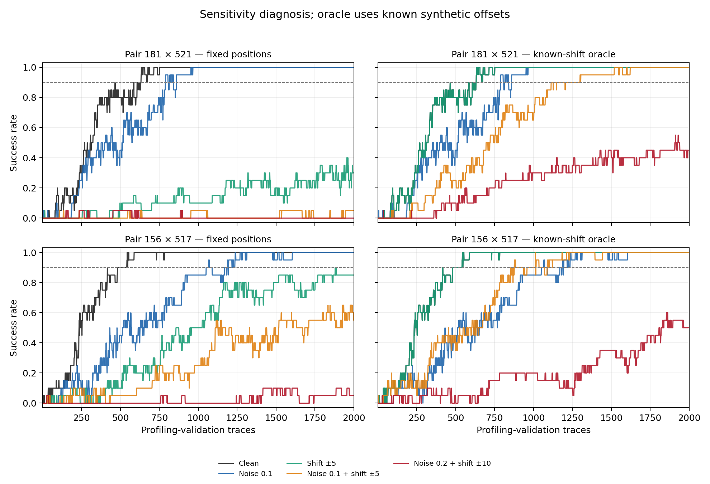

# Ευαισθησία δεύτερης τάξης correlation — 2026-10-05

Στο ίδιο profiling validation του ASCAD, ο θόρυβος σ=0,1 διατηρεί ανάκτηση
20/20 στα δύο ήδη επιλεγμένα ζεύγη. Ο συνδυασμός σ=0,1 και μετατόπισης ±5
μειώνει την επιτυχία στα σταθερά σημεία σε **1/20 και 11/20**. Αν γνωρίζουμε
την τεχνητή μετατόπιση κάθε trace και διαβάσουμε τα αρχικά σημεία στη νέα θέση,
η επιτυχία επανέρχεται σε **20/20 και στα δύο**. Στο σ=0,2 αυτή η διόρθωση
δεν αρκεί για 90% επιτυχία εντός 2.000 traces.

Πρόκειται για CPU διάγνωση με παγωμένα σημεία και κέντρα, χωρίς νέα εκπαίδευση.
Η διόρθωση με γνωστή μετατόπιση είναι **oracle control**: χρησιμοποιεί πληροφορία
από τη δημιουργία της τεχνητής αλλοίωσης. Δεν αποτελεί έτοιμη μέθοδο εκτίμησης
ευθυγράμμισης από τα traces. Τα αποτελέσματα δεν μετρούν όφελος training augmentation.

## Παγωμένο πρωτόκολλο

Το [plan.json](plan.json) γράφτηκε πριν από την εκτέλεση. Οι οκτώ εντάσεις προέρχονται
από το ήδη υπάρχον `configs/evaluation_final.json`, αλλά εφαρμόστηκαν αποκλειστικά
στο **profiling validation**, με 20 επαναλήψεις. Δεν χρησιμοποιήθηκε το final attack set.

- ASCAD fixed-key, 700 samples, zero-based byte 2. Ίδιο training 10.000 / validation 5.000,
  split seed 2026 και split ID `1c9656f9ba13791a7ba4781a5518420f4fef4e303c979d4c307cc6ed27ee9090`.
- Παλιότερη training-only επιλογή σημείων: `rout` = 181×521, `r3` = 156×517.
  Εκείνη η επιλογή αξιοποίησε training mask/share metadata. Δεν επιλέχθηκαν νέα
  σημεία από τις τωρινές validation επιδόσεις και δεν συνδυάστηκαν τα δύο ζεύγη.
- Per-position MinMax και μέση τιμή σε κάθε θέση υπολογίζονται μόνο από τα training
  traces. Τα normalized inputs είναι float32, τα κέντρα και τα προϊόντα float64.
  Τα κέντρα παραμένουν σταθερά σε όλες τις αλλοιώσεις. Δεν γίνεται clipping/refit στο validation.
- Για κάθε trace το προϊόν είναι `(x[i]−center[i])*(x[j]−center[j])`.
  Οι 256 υποθέσεις είναι `HW(Sbox(plaintext_byte XOR candidate_key))`.
  Βαθμολογία: απόλυτη Pearson correlation σε κάθε prefix. Το σωστό key byte
  χρησιμοποιείται μόνο για την αναφορά rank, όχι για τη βαθμολόγηση των υποθέσεων.
- Rank 0 = καλύτερο. Τα ties αντιμετωπίζονται συντηρητικά, με ανοχή 1e−12:
  `count(score >= true_score−tolerance)−1`. Constant/singleton prefixes έχουν scores 0.
- 20 κοινές τυχαίες σειρές από το validation pool των 5.000, budget 2.000, seed 8001.
  Το SR είναι το ποσοστό σειρών με τελικό rank 0 και το GE ο μέσος τελικός rank.
  Sustained SR90 = πρώτο prefix από το οποίο το SR παραμένει ≥0,90 μέχρι το budget.
  Το «—» δηλώνει ότι αυτό δεν επιτεύχθηκε εντός του budget.
- Corruption seed 9001, batches 256, non-circular uniform integer shifts,
  zero padding, κατόπιν iid Gaussian noise. Οι πράξεις και η σειρά RNG draws
  επαληθεύτηκαν έναντι της παραγωγικής `augment_batch`.

Οι αλλοιώσεις γίνονται **μετά το per-position MinMax, στον χώρο των features**.
Το σ εκφράζεται σε normalized μονάδες. Αυτό το πείραμα δεν προσομοιώνει ισοδύναμα
raw φυσικό θόρυβο ή jitter πριν από την ανά θέση κανονικοποίηση.

## Αποτελέσματα στα 2.000 traces

Κάθε κελί δίνει **επιτυχίες/20 · GE**. Oracle: εξαγωγή στις θέσεις `i+δ`, `j+δ`,
με τη γνωστή injected μετατόπιση δ του συγκεκριμένου trace και τα αρχικά training centers.

| Συνθήκη (σ, ±shift) | Σταθερό 181×521 | Σταθερό 156×517 | Oracle 181×521 | Oracle 156×517 |
|---|---:|---:|---:|---:|
| Clean (0, 0) | 20/20 · 0 | 20/20 · 0 | 20/20 · 0 | 20/20 · 0 |
| Noise matched (0,1, 0) | 20/20 · 0 | 20/20 · 0 | 20/20 · 0 | 20/20 · 0 |
| Shift matched (0, ±5) | 6/20 · 11,40 | 17/20 · 0,15 | 20/20 · 0 | 20/20 · 0 |
| Combined matched (0,1, ±5) | 1/20 · 37,35 | 11/20 · 3,30 | 20/20 · 0 | 20/20 · 0 |
| Combined mild (0,05, ±2) | 20/20 · 0 | 20/20 · 0 | 20/20 · 0 | 20/20 · 0 |
| Combined noise OOD (0,2, ±5) | 0/20 · 115,25 | 4/20 · 57,55 | 4/20 · 23,80 | 14/20 · 0,80 |
| Combined shift OOD (0,1, ±10) | 0/20 · 68,80 | 2/20 · 49,95 | 20/20 · 0 | 20/20 · 0 |
| Combined both OOD (0,2, ±10) | 0/20 · 118,05 | 1/20 · 82,55 | 9/20 · 4,70 | 10/20 · 3,90 |

| Συνθήκη | SR90 traces: σταθερό 181×521 | Σταθερό 156×517 | Oracle 181×521 | Oracle 156×517 |
|---|---:|---:|---:|---:|
| Clean | 631 | 481 | 631 | 481 |
| Noise matched | 860 | 1.194 | 860 | 1.194 |
| Shift matched | — | — | 631 | 481 |
| Combined matched | — | — | 1.205 | 1.088 |
| Combined mild | 1.399 | 1.234 | 775 | 612 |
| Combined noise OOD | — | — | — | — |
| Combined shift OOD | — | — | 887 | 1.003 |
| Combined both OOD | — | — | — | — |




Ο μέτριος θόρυβος αυξάνει τα traces που απαιτούνται για sustained SR90, παρότι
στο τέλος και τα δύο ζεύγη πετυχαίνουν 20/20. Η καθαρή μετατόπιση υποβαθμίζει
διαφορετικά τα δύο παγωμένα ζεύγη. Με την oracle εξαγωγή της καθαρής μετατόπισης,
τα προϊόντα ανακτώνται ακριβώς και οι καμπύλες επιστρέφουν στις clean τιμές.
Η επαναφορά στις matched αλλοιώσεις είναι συνεπής με την ευθυγράμμιση ως σημαντικό
περιορισμό της εξαγωγής σε σταθερές θέσεις. Δεν αποδεικνύει ότι μια πρακτική μέθοδος
μπορεί να εκτιμήσει σωστά τις μετατοπίσεις, ούτε εξηγεί από μόνη της την αποτυχία του CNN.

Τα oracle αποτελέσματα σε σ=0,2 παραμένουν κάτω από το κριτήριο 18/20. Οι αριθμητικές
διαφορές ανάμεσα στις OOD συνθήκες δεν τεκμηριώνουν μονοτονική συμπεριφορά ή βέλτιστη
ένταση: χρησιμοποιήθηκε μία realization ανά συνθήκη, χωρίς βελτιστοποίηση εντάσεων.

## Pairing, padding και όρια της ερμηνείας

Μέσα σε κάθε συνθήκη, τα δύο ζεύγη και οι δύο τρόποι εξαγωγής χρησιμοποιούν τα ίδια
corrupted traces. Όλες οι συνθήκες χρησιμοποιούν τις ίδιες σειρές traces. Το RNG
κάνει εναλλάξ draws για shift και noise ανά batch· το ίδιο seed **δεν εγγυάται ίδιες
μετατοπίσεις μεταξύ διαφορετικών συνθηκών**, π.χ. shift-only έναντι combined.
Δεν αποδίδουμε τη διαφορά αυτών των δύο αριθμών αποκλειστικά στην προσθήκη θορύβου.

Επαναλήφθηκαν οι αλλοιώσεις με edge padding, ίδια RNG draws μέσα σε κάθε συνθήκη.
Και τα 32 προϊόντα fixed/oracle είναι **ακριβώς ίδια** με zero και edge padding:
τα επιλεγμένα σημεία βρίσκονται στο εσωτερικό και κανένα δεν αποκόπηκε ακόμη και για ±10.
Στις συνθήκες ±5 απορρίφθηκε κατά μέσο όρο περίπου 0,391% των waveform samples,
και στις ±10 περίπου 0,739%. Τα άκρα των πλήρων traces αλλάζουν· ο έλεγχος αποκλείει
επίδραση padding στα συγκεκριμένα προϊόντα, όχι στα CNNs που διαβάζουν όλο το trace.

Οι 20 σειρές έχουν αλληλεπικαλυπτόμενα traces από το ίδιο pool, δεν είναι 20 ανεξάρτητες
φυσικές καταγραφές. Το SR είναι περιγραφικό για αυτό το fixed-key validation και αυτό
το corruption seed. Δεν εκτιμήθηκε μεταβλητότητα μεταξύ corruption seeds, συσκευών ή
κλειδιών. Η προηγούμενη επιλογή με mask metadata προσφέρει διαφορετική πληροφορία
από το identity-label CNN· αυτή δεν είναι σύγκριση με ίσο profiling information.
Δεν διατυπώνεται ισχυρισμός πρωτοτυπίας ή επιτυχίας σε final attack.

## Επαλήθευση, κόστος και παραδοτέα

- 640 τελικά ranks (32 αποτελέσματα × 20 σειρές) συμφωνούν με ανεξάρτητο τύπο
  centered-dot-product Pearson. GE/SR/sustained curves επανελέγχθηκαν από τα ranks.
- Οι οκτώ πλήρεις corrupted tensors αναπαράχθηκαν με την παραγωγική `augment_batch`
  και συμφωνούν στα hashes. Τα offsets αναπαίχθηκαν ξεχωριστά και τα προϊόντα
  υπολογίστηκαν ξανά με άμεσο NumPy indexing. Training-only MinMax/centering επαληθεύτηκαν.
- Οι clean καμπύλες συμφωνούν με την προηγούμενη raw-space διάγνωση σε 100% των
  prefixes για rout και 99,9975% για r3 (μία διαφορά σε 40.000 intermediate ranks,
  μετά τη float32 κανονικοποίηση). Endpoints και sustained SR90 παραμένουν ίδια.
- **44 tests passed**, 14 υπάρχοντα deprecation warnings, 32,51s. Τα επτά νέα tests
  ελέγχουν RNG parity σε διαφορετικά batches, πρόσημο/θέση oracle, cropping και padding.
  Τα συνθετικά fixtures τεκμηριώνουν ορθότητα κώδικα, όχι φυσική αποτελεσματικότητα.
- Η CPU μέτρηση διήρκεσε **47,52s**, η ανεξάρτητη επαλήθευση **6,07s**.
  Μηδέν νέα optimization steps στο πραγματικό dataset, μηδέν νέα Kaggle sessions.
  Τα smoke tests εκπαιδεύουν μόνο μικρά συνθετικά fixtures σε CPU.
- Παγωμένος training source, best/last checkpoint, ενεργό Kaggle packet και notebook
  διατηρήθηκαν. Σύνολο **3 πλήρη GPU trainings, 1 `.ipynb`**. Το αρχικό CNN gate
  παραμένει failed και το conditional combined δεν εκτελέστηκε.

Αναπαραγωγή από τον project root, με το υπάρχον dataset/checkpoint:

```powershell
& .\.venv\Scripts\python.exe notebooks/audit_correlation_robustness.py
& .\.venv\Scripts\python.exe notebooks/verify_correlation_robustness.py
& .\.venv\Scripts\python.exe notebooks/plot_correlation_robustness.py
& .\.venv\Scripts\python.exe -m pytest -q
```

Οι CPU companions είναι `.py` στον φάκελο `notebooks/`, εκτός του παγωμένου training
source fingerprint. Δεν δημιουργήθηκε πρόσθετο Kaggle notebook.
Τα [results.json](results.json), [metrics.csv](metrics.csv), [audit_arrays.npz](audit_arrays.npz)
και [verification.json](verification.json) περιέχουν τις μετρήσεις, curves, offsets,
κέντρα, checksums και ελέγχους. Τα δύο διαγράμματα επιθεωρήθηκαν οπτικά.

Επόμενο βήμα: σύνθεση των ήδη επιβεβαιωμένων θετικών και αρνητικών αποτελεσμάτων
και έλεγχος του ερευνητικού ερωτήματος πριν από νέα GPU πρόταση. Μια πρακτική
ευθυγράμμιση θα χρειαστεί ξεχωριστό πρωτόκολλο χωρίς γνωστά injected offsets.
Νέο baseline και combined θα απαιτούσαν δύο πρόσθετα trainings, οπότε δεν χωρούν
στο ισχύον όριο τεσσάρων με τα τρία ήδη ολοκληρωμένα. Η παρούσα διάγνωση δεν αλλάζει
αυτό το όριο ή τον κανόνα του CNN gate.
