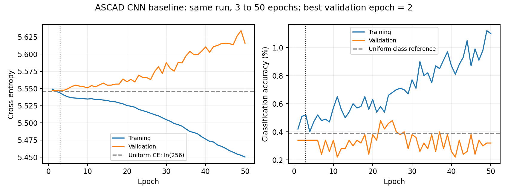
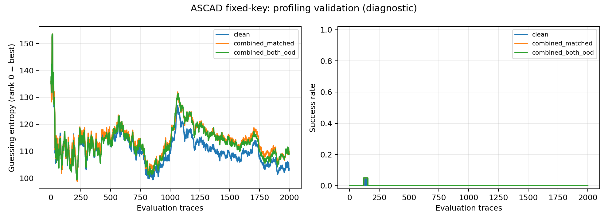

# Πραγματικό Kaggle baseline — 2026-10-03

Το υπάρχον ιδιωτικό [hw_sec_exp2](https://www.kaggle.com/code/con1los/hw-sec-exp2)
εκτελέστηκε μέσω του API του χρήστη, version3, σε Tesla T4. Το API επέστρεψε COMPLETE
και κατεβάστηκαν checkpoint archive, manifests, history, validation curves και logs.

## Τι εκτελέστηκε

Το ίδιο CNN χωρίς augmentation, seed0, 10.000 training / 5.000 validation traces,
συνεχίστηκε από την epoch3 στην epoch50. Προστέθηκαν ακριβώς 47 epochs / 3.713 steps.
Οι πρώτες 3 epochs διατηρήθηκαν χωρίς αλλαγή· συνολικά 50 epochs / 3.950 steps.
Ένα πλήρες μοντέλο από τα τέσσερα προγραμματισμένα έχει ολοκληρωθεί.

Επαληθεύτηκαν ίδιο training source hash, dataset checksum, environment, splits και
normalizer, καθώς και CRC και byte-for-byte συμφωνία των 49 αρχείων του output archive
με τα downloaded files. Ο καλύτερος checkpoint παρέμεινε byte-identical στην epoch2.
Δεν εκτελέστηκαν οι άλλες τρεις εκπαιδεύσεις ή τελική αξιολόγηση στο attack set.

## Validation αποτελέσματα

Χρησιμοποιήθηκε το προκαθορισμένο καλύτερο checkpoint κατά clean validation
cross-entropy. Κάθε συνθήκη αξιολογήθηκε με 2.000 traces και 20 κοινές permutations
από το profiling validation pool των 5.000 traces. Rank0 σημαίνει σωστό byte πρώτο.
Οι stored ranks ελέγχθηκαν ανεξάρτητα έναντι όλων των GE/SR curves.

| Συνθήκη | GE@2.000 | SR@2.000 |
|---|---:|---:|
| clean | 103,50 | 0% (0/20) |
| Gaussian noise0,1 + shifts έως5 | 109,85 | 0% (0/20) |
| Gaussian noise0,2 + shifts έως10 | 109,25 | 0% (0/20) |

Το sustained SR90% criterion δεν επιτεύχθηκε σε καμία συνθήκη· τα trace counts
είναι censored ως >2.000. Οι permutations δεν αποτελούν ανεξάρτητα training seeds.

Η καλύτερη validation CE είναι 5,547229 στην epoch2. Στην epoch50, train CE5,450314,
train accuracy1,10%, validation CE5,616101 και validation accuracy0,32%.
Η uniform CE ln(256)=5,545177 είναι αριθμητική αναφορά. Οι καμπύλες δείχνουν βελτίωση
στο training και επιδείνωση στο validation, χωρίς χρήσιμη ανάκτηση byte στο παρόν budget.
Αυτό αφορά το συγκεκριμένο CNN/config και δεν αποδεικνύει ότι τα augmentations αποτυγχάνουν.

## Πραγματικό κόστος

Οι νέες training loops χρειάστηκαν 16,462s. Οι training loops όλων των 50 epochs,
μαζί με το προηγούμενο benchmark, αθροίζονται σε18,079s· validation loops3,490s.
Η κλήση συνέχισης με setup/checkpoints χρειάστηκε29,175s. Το notebook log φτάνει περίπου
277s μαζί με dependency installation, tests, evaluation και HTML export. Αυτό δεν
μετρά αναμονή ουράς ή το προσωπικό GPU quota, που δεν έχει επαληθευθεί.

## Συνέχεια με ελάχιστες εκτελέσεις

Το checkpoint της epoch50 έχει διατηρηθεί τοπικά στο
`runs/kaggle_control/baseline_v3_output/sca_runs_minimal_v1.zip`.
Το ίδιο ιδιωτικό Input `con1los/hardware-sca-resume` ενημερώθηκε σε version2 με αυτό
το checkpoint. Η version4 του ίδιου notebook αποθηκεύτηκε ως QUICK_SAVE, χωρίς νέα
εκτέλεση GPU. Τα πραγματικά αποτελέσματα προέρχονται από τη version3.
Το επόμενο resume Input πρέπει να περιέχει αυτό το archive, ώστε completed baseline
να επαναχρησιμοποιείται. Πριν από τις άλλες τρεις στρατηγικές, χρειάζεται διάγνωση
του baseline στο profiling/validation και αιτιολόγηση τυχόν αλλαγών. Δεν τροποποιούμε
τον τρέχοντα training κώδικα ούτε ανοίγουμε το final attack set για tuning.

Αρχεία ελέγχου: `verification.json`, `manifest.json`, `history.json`, `summary.json`,
`call_baseline.json`, `execution.log`, `validation/results.json` και οι CSV/NPZ curves.
