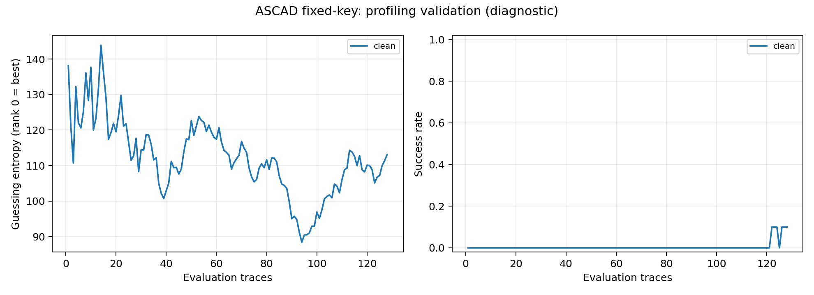

# Πρώτο Kaggle benchmark — 3 Οκτωβρίου 2026

Το `results.zip` περιέχει πραγματικό ASCAD benchmark του CNN χωρίς augmentation:
**3 epochs στην Tesla T4**, 10.000 training traces και 5.000 profiling-validation traces.
Το επόμενο βήμα είναι η συνέχιση του ίδιου run έως 50 epochs στο ίδιο notebook.
Δεν περιλαμβάνονται ακόμη πλήρες baseline, άλλες augmentation στρατηγικές ή τελική attack αξιολόγηση.

## Καταγεγραμμένη εκτέλεση

| Στοιχείο | Αποτέλεσμα |
|---|---|
| Dataset | Original synchronized ASCAD fixed-key, επίσημο checksum verified |
| Μοντέλο | CNN, 197.424 parameters, byte index2, identity classes |
| GPU / runtime | Tesla T4, PyTorch2.8.0+cu126, CUDA12.6, Python3.13.15 |
| Training / validation | 10.000 / 5.000, seed0, split seed2026 |
| Στάδιο | `benchmark`, none augmentation |
| Epochs / steps | 3 / 237 |
| Training loops | 1,617 s |
| Validation loops | 0,239 s |
| Training call μαζί με setup/checkpoint I/O | 11,495 s |
| Επιλεγμένο checkpoint | epoch2, clean validation CE5,547229 |
| Clean validation evaluation | 128 traces ανά δοκιμή, 10 permutations από pool5.000 |
| GE@128 | 113,1, zero-based rank |
| SR@128 | 10%, δηλαδή 1 από τις 10 δοκιμές |
| Sustained SR≥90% | δεν επιτεύχθηκε, censored `>128` |

Οι χρόνοι προέρχονται από τα [training records](records/none_seed0/summary.json) και
την [καταγραφή της κλήσης](records/none_seed0/call_benchmark.json). Δεν είναι ολόκληρος
ο χρόνος του notebook, ούτε συγκρίνονται ως ίδιο hardware με το προηγούμενο CPU pilot.
Το προσωπικό GPU quota και το session limit παραμένουν `null` στο `account_budget.json`.

Οι τελικές θέσεις του σωστού key byte στις 10 validation δοκιμές είναι:
`0, 232, 208, 99, 49, 188, 153, 32, 135, 35`.
Το GE είναι η μέση θέση και το SR το ποσοστό δοκιμών με θέση0.
Μία επιτυχία δεν καλύπτει το προκαθορισμένο κριτήριο συστηματικής ανάκτησης.
Οι δοκιμές μοιράζονται traces και το ίδιο μοντέλο· δεν είναι 10 ανεξάρτητες εκπαιδεύσεις.
Το loss παραμένει κοντά στο uniform reference `ln(256)≈5,545` και καταγράφεται ως
βοηθητική μετρική. Δεν υπάρχει ακόμη σύγκριση που να υποστηρίζει ή να αποδυναμώνει το joint augmentation.



## Επαλήθευση των παραδοτέων

Το [verification.json](verification.json) καταγράφει τους ελέγχους:

- CRC του αρχείου και byte-for-byte συμφωνία των εξωτερικών run files με το nested output ZIP.
- SHA-256 του code snapshot ίδιο με το manifest και με τον τοπικό πηγαίο κώδικα.
- Checksum `best.pt` ίδιο με την ταυτότητα της αξιολόγησης, χωρίς deserialization checkpoint.
- Ακριβής συμφωνία training/validation indices με το αναμενόμενο split, χωρίς κοινές rows.
- Επαναϋπολογισμός της κανονικοποίησης αποκλειστικά στα 10k training traces.
- Συμφωνία GE/SR στο JSON και CSV με όλες τις καμπύλες των αποθηκευμένων per-repetition ranks.
- Training counts/timings/history συνεπή, και επίσημο dataset SHA-256 επιβεβαιωμένο τοπικά.

Δεν εκτελέστηκε κώδικας από το επισυναπτόμενο archive ούτε νέα εκπαίδευση.
Το archive έχει pytest cache, αλλά δεν περιλαμβάνει console test output· δεν εξάγουμε
από το cache νέο αριθμό επιτυχημένων GPU tests. Το γράφημα επιθεωρήθηκε οπτικά.
Τα checkpoints διατηρούνται στο ignored `runs/kaggle_imports/2026-10-03_07b13e6f/` και
οι μικρές καταγραφές/καμπύλες βρίσκονται στο `records/` αυτού του φακέλου.

## Κόστος και συνέχεια

Η καταγεγραμμένη πρόβλεψη για τα υπόλοιπα 15.563 training steps είναι περίπου
**1,81 λεπτά training loops**, με margin50%, στην ίδια GPU. Προέρχεται από τις
none epochs2–3. Εξαιρεί validation, evaluation, setup, dependencies και I/O, ενώ το
augmentation overhead δεν έχει μετρηθεί. Δεν είναι υπόσχεση συνολικής διάρκειας notebook.

1. Αν το Kaggle session παραμένει ενεργό με τα run folders, στο ίδιο notebook βάλε
   `STAGE="baseline"`, κράτα `RUN_TAG="minimal_v1"` και `RESTORE_ARCHIVE=None`.
2. Αν ξεκινά νέο session, ανέβασε το ήδη εξαχθέν `sca_runs_minimal_v1.zip` ως private
   Input, κατά προτίμηση στο ίδιο dataset. Μετά τις discovery cells βάλε:

   ```python
   STAGE = "baseline"
   RUN_TAG = "minimal_v1"
   RESTORE_ARCHIVE = str(next(INPUT_ROOT.rglob("sca_runs_minimal_v1.zip")))
   ```

   Πρόσθεσε ακριβώς ένα archive συνέχισης. Το αρχείο βρίσκεται τοπικά στο
   `runs/kaggle_imports/2026-10-03_07b13e6f/sca_runs_minimal_v1.zip`.
   Χρησιμοποίησε το ίδιο source bundle/GPU/runtime ώστε να περάσει ο έλεγχος exact resume.
   Το υπάρχον source hash ταιριάζει· δεν χρειάζεται νέα έκδοση κώδικα για αυτό το βήμα.
3. Εκτέλεσε τις settings/training/output cells και διατήρησε το νέο output archive.
   Αναμένουμε `epochs=50`, `optimization_steps=3950`, `resumed_at_epoch=3`.
4. Εξέτασε clean/matched-joint/OOD-joint validation πριν προχωρήσεις στο `compare`.
   Αν το baseline δεν είναι λειτουργικό, πρώτα διαγιγνώσκουμε το πρόβλημα· δεν εκκινούμε
   πρόσθετα trainings χωρίς συγκεκριμένο λόγο και συμφωνία του χρήστη.

Το μοντέλο none παραμένει **μία** από τις τέσσερις προγραμματισμένες εκπαιδεύσεις.
Το στάδιο attack παραμένει για μετά την ολοκλήρωση και το protocol freeze.
