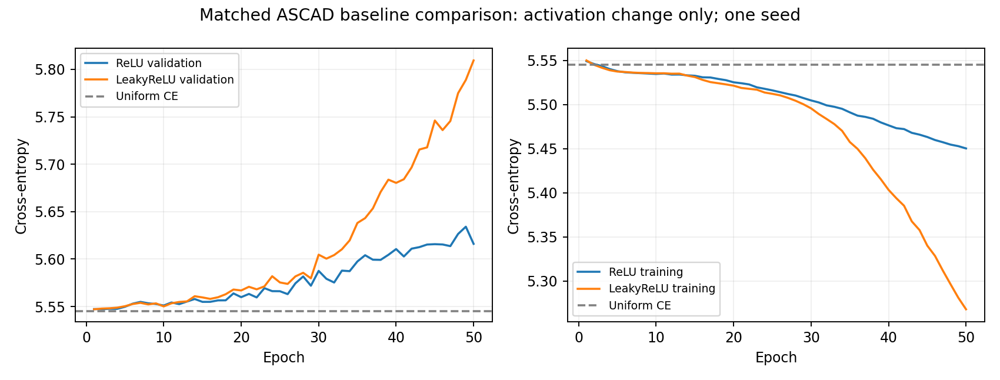

# Διορθωτικό ASCAD baseline — 2026-10-03

Ολοκληρώθηκε μία εγκεκριμένη διορθωτική εκπαίδευση στο ίδιο ιδιωτικό
[Kaggle notebook](https://www.kaggle.com/code/con1los/hw-sec-exp2), version5.
Έχουν γίνει **δύο πλήρη GPU trainings συνολικά**, συμπεριλαμβανομένου του αρχικού
αποτυχημένου ReLU baseline. Το διορθωμένο baseline δεν ανακτά ακόμη το byte2 του
κλειδιού στο validation. Οι τρεις augmentations δεν εκτελέστηκαν.

## Ακριβής αλλαγή και εκτέλεση

Αλλάξαμε αποκλειστικά τις τρεις ReLU σε LeakyReLU με negative slope0,1.
Ίδια initialization στο seed0, 197.424 parameters, official synchronized ASCAD
fixed-key700, zero-based byte2 / 256 identity classes, 10.000 training traces,
5.000 disjoint validation traces, split seed2026 και training-only scalar normalization.
Adam LR0,001 / batch128 / 50 epochs / 3.950 steps. Το νέο run ξεκίνησε από epoch0,
χωρίς μεταφορά weights ή optimizer από το αρχικό baseline. Και τα δύο έχουν ίδιο
Tesla T4 / Torch2.8.0+cu126 / CUDA12.6 / Python3.13.15 περιβάλλον.

## Αποτελέσματα

Checkpoint επιλογή: ελάχιστο clean validation cross-entropy μέσα στις 50 epochs.
Τα GE/SR υπολογίστηκαν από τα best checkpoints, με κοινές 20 permutations,
2.000 traces ανά permutation, από το profiling validation pool των 5.000.
Rank0 = καλύτερο· χαμηλότερο GE είναι καλύτερο.

| Μετρική | Αρχικό ReLU | Διορθωμένο LeakyReLU |
|---|---:|---:|
| Best epoch | 2 | 1 |
| Best validation CE | 5,547229 | 5,547114 |
| Epoch50 training CE | 5,450314 | 5,267826 |
| Epoch50 validation CE | 5,616101 | 5,809435 |
| Epoch50 validation accuracy | 0,32% | 0,38% |
| Clean GE@2.000 | 103,50 | 89,25 |
| Matched noise0,1 / shift5 GE@2.000 | 109,85 | 92,50 |
| OOD noise0,2 / shift10 GE@2.000 | 109,25 | 96,65 |
| SR@2.000 σε κάθε συνθήκη | 0/20 | 0/20 |

Το μικρότερο GE είναι περιγραφική διαφορά σε ένα seed, χωρίς επιτυχή ανάκτηση.
Δεν τεκμηριώνει σταθερή βελτίωση ούτε επιτυχία σε ανεξάρτητο attack set.
Το best CE5,547114 παραμένει πάνω από το uniform CE ln(256)=5,545177.
Το training loss μειώνεται, ενώ το validation loss αυξάνεται: το μοντέλο μαθαίνει
το training set χωρίς χρήσιμη γενίκευση με αυτό το πρωτόκολλο.

## Ανεξάρτητη επαλήθευση

- Dataset SHA256, ίδια splits/normalizer, source hash και runtime ελέγχθηκαν.
- 50 history epochs / 3.950 steps, best epoch1 και completed summary συμφωνούν.
- Archive CRC: 21 αρχεία. Επτά αρχεία κατέβηκαν και ανεξάρτητα και συμφωνούν byte-for-byte.
- Όλες οι GE/SR καμπύλες αναϋπολογίστηκαν από τα αποθηκευμένα ranks20×2.000.
- Read-only CPU φόρτωση των best/last επαλήθευσε τα validation CE/accuracy.
  Best CE5,547114207· fixed shuffled-label control5,547113638.
- Fixed-weight backward σε128 training rows δίνει μη μηδενικό dense gradient64/64
  στο best και last. Δεν έγινε optimizer step και τα checkpoints παρέμειναν αμετάβλητα.
  Η αποφυγή μηδενικών gradients δεν αποκατέστησε από μόνη της τη γενίκευση.
- Μετά τις αλλαγές μοντέλου/bootstrap: 26 tests passed,14 warnings σε10,37s.

Πλήρη στοιχεία: [verification.json](verification.json),
[CPU review](cpu_checkpoint_review.json), [history](history.json),
[validation results](validation/results.json), [log](execution.log).

## Χρόνος και διατήρηση

Training loops19,110s, validation loops3,925s, training call33,796s.
Το notebook log καλύπτει περίπου359,754s μαζί με εγκατάσταση dependencies,
tests και εξαγωγή. Το προσωπικό quota δεν επαληθεύτηκε και δεν το εξισώνουμε με
τον χρόνο των training loops.

Run: `runs/kaggle_control/leaky_v5_output/runs/minimal_v2_leaky/none_seed0`.
Archive: `runs/kaggle_control/leaky_v5_output/sca_runs_minimal_v2_leaky.zip`.
Archive SHA256: `7f9590e617ed70b9ba42eaea3afc0c2102989064cc9d8837c4ab07c072d4baa0`.
Training source SHA256: `6f72dd833c610ef73c9e1935dbd46b3acf245b3bf1910b9b80d09d3623d73126`.
Το παλιό ReLU archive παραμένει χωριστά και δεν αντικαταστάθηκε.

Το ολοκληρωμένο νέο checkpoint διατηρήθηκε στο ίδιο private Input, version4.
Η version6 του ίδιου notebook αποθηκεύτηκε με QUICK_SAVE, χωρίς εκτέλεση GPU.
Επαληθεύτηκαν remote history50 byte-for-byte, notebook cell sources και ιδιωτικότητα.
Το `outputs/kaggle_resume_input_leaky.zip` είναι το ενεργό πακέτο αποκατάστασης·
`require_checkpoint=True` αποτρέπει ακούσιο νέο baseline. Τοπικό extracted-layout
restore και repeated bootstrap κράτησαν αμετάβλητο checkpoint.

## Απόφαση για τη συνέχεια

Το validation gate δεν πέρασε. Διατηρούμε τα δύο αρνητικά αποτελέσματα και
δεν ξεκινάμε τις άλλες τρεις εκπαιδεύσεις τώρα. Επόμενη χρήσιμη εργασία είναι
έλεγχος της καταλληλότητας της μικρής αρχιτεκτονικής και του identity-label στόχου
για masked ASCAD, με πρωτογενή βιβλιογραφία και read-only profiling diagnostics.
Η αιτία δεν αποδείχθηκε μοναδική. Κάθε πρόσθετη εκπαίδευση πέρα από το εγκεκριμένο
πλάνο απαιτεί συγκεκριμένο ερευνητικό λόγο και συμφωνία χρήστη.
Το final attack set δεν αξιολογήθηκε και το protocol freeze παραμένει false.
