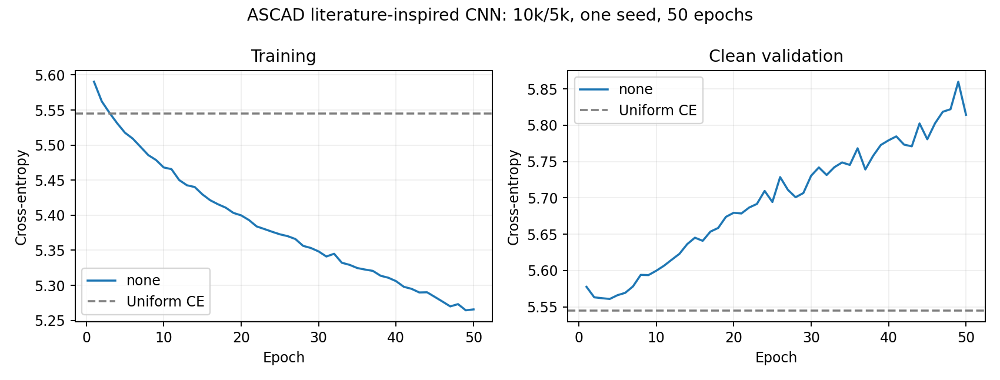

# Τρίτο baseline ASCAD — ελεγμένο αρνητικό αποτέλεσμα

Το εγκεκριμένο literature-inspired CNN ολοκλήρωσε50epochs, αλλά το καλύτερο
checkpoint είχε clean validation SR@2.000=0/20. Το προκαθορισμένο gate απαιτούσε18/20,
οπότε **το combined δεν εκπαιδεύτηκε**. Έγιναν τρία πλήρη GPU trainings συνολικά,
όλα στο ίδιο ιδιωτικό [Kaggle notebook](https://www.kaggle.com/code/con1los/hw-sec-exp2).
Η συγκεκριμένη εκτέλεση είναι version7. Δεν έγινε final attack evaluation.

## Τι εκτελέστηκε

- Επίσημο synchronized fixed-key ASCAD700, zero-based byte2,256 identity classes.
- Ίδιο split2026:10.000 training και5.000 validation traces, training seed0.
- `cnn_literature`,16.952 trainable parameters: Conv4/k1, SELU/BatchNorm,
  AvgPool2, dense10×2, logits256. Hidden He και output Glorot initialization.
- Per-position MinMax fit μόνο στα10.000 training rows. Τα ίδια700 minima/scales
  χρησιμοποιήθηκαν στο validation, χωρίς refit ή clipping.
- Adam LR0,001, batch128,50epochs,79steps/epoch,3.950 συνολικά.
- Checkpoint selection: ελάχιστη καθαρή validation cross-entropy σε όλες τις50epochs.
- Validation key ranking:20 κοινές permutations από5.000 rows, budget2.000,
  order seed8001, corruption seed9001, rank0=πρώτη θέση με συντηρητική μεταχείριση ties.

Αρχιτεκτονική εμπνευσμένη από τον [κώδικα των Zaid et al.](https://github.com/gabzai/Methodology-for-efficient-CNN-architectures-in-SCA/blob/master/ASCAD/N0%3D0/cnn_architecture.py).
Η [δημοσίευσή τους](https://eprint.iacr.org/2019/803.pdf) χρησιμοποιεί διαφορετικό
training budget, batch και learning-rate schedule. Εδώ δεν έγινε αναπαραγωγή των
δημοσιευμένων αποτελεσμάτων. Άλλαξαν μαζί μοντέλο και κανονικοποίηση σε σχέση με
τα παλιότερα baselines· η ιστορική σύγκριση δεν απομονώνει την αιτία κάθε διαφοράς.

## Αποτελέσματα

Best epoch4: validation CE5,560782 και accuracy0,44%. Η ομοιόμορφη πρόβλεψη των
256 classes έχει CEln(256)=5,545177. Στην epoch50: train CE5,265615 / accuracy2,26%,
validation CE5,814250 / accuracy0,44%. Η βελτίωση του training loss δεν μεταφέρθηκε
στη validation. Τα στοιχεία είναι συμβατά με overfitting· δεν αποδεικνύουν μία
συγκεκριμένη αιτία αποτυχίας ούτε ότι δεν υπάρχει εκμεταλλεύσιμη διαρροή στο ASCAD.

| Validation condition του baseline | Noise σ / shift | GE@2.000 | SR@2.000 |
|---|---|---:|---:|
| clean |0 /0|114,25|0/20|
| combined_matched |0,1 /5|68,25|0/20|
| combined_both_ood |0,2 /10|57,05|0/20|

Οι δύο τελευταίες γραμμές είναι **corrupted evaluations του ίδιου baseline**,
όχι δύο πρόσθετα trainings. Χαμηλότερο GE εδώ δεν σημαίνει επιτυχή ανάκτηση,
ούτε όφελος από training augmentation: το combined μοντέλο δεν εκτελέστηκε.
Οι corruptions εφαρμόζονται μετά το per-position MinMax σε feature space.
Δεν ισοδυναμούν με physical raw jitter/noise πριν από την κανονικοποίηση.

## Έλεγχοι και πραγματικό κόστος

Πέρασαν33 local tests και33 Kaggle tests (8,10s στο Kaggle,14 warnings).
Το archive πέρασε CRC για22 αρχεία. Εννέα αρχεία κατέβηκαν και ανεξάρτητα και
συμφωνούν byte-for-byte με το archive. Επιβεβαιώθηκαν source/data/split hashes,
όλες οι50epochs/3.950steps, η ελάχιστη CE και η απουσία combined/noise/shift runs.
Τα GE/SR curves υπολογίστηκαν ξανά από τα αποθηκευμένα ranks20×2.000.

Το MinMax επανυπολογίστηκε από τα πραγματικά training indices και συμφωνεί ακριβώς
με τα saved statistics. Έγινε CPU forward χωρίς optimizer updates στα δικά μας
best/last checkpoints: CE5,560781929 και5,814249825, εντός1e-7 των GPU values.

TeslaT4, PyTorch2.8.0+cu126/CUDA12.6, Python3.13.15, threads2. Το περιβάλλον και
τα δεδομένα/splits συμφωνούν με το προηγούμενο baseline. Training loops14,854s,
clean validation loops3,423s, πλήρης κλήση training25,912s. Το log φτάνει300,285s
μαζί με dependency installation, tests, evaluation και export. Η εγκατάσταση του
περιβάλλοντος κυριαρχεί στο συνολικό κόστος. Δεν έχουμε επαληθευμένο προσωπικό
GPU quota και δεν εξισώνουμε τον loop χρόνο με χρέωση/κατανάλωση quota.

Source SHA256: `84eff3cde04c0e9a1756a3d29c44ec82e115a1a08575132686a02520333e2b5c`.
Archive SHA256: `52f71851f5c3584ba7af26d23296b07a7cb15355dfc771b39cb878267aba384c`.
Όλα τα αριθμητικά τεκμήρια βρίσκονται στο [verification.json](verification.json),
στο [baseline_gate.json](baseline_gate.json) και στα αρχεία του `none/`.

## Κατάσταση και επόμενο βήμα

Το gate απέτυχε και η εγκεκριμένη conditional σύγκριση σταμάτησε πριν το combined.
Το final attack set παραμένει κλειστό για επιλογή μοντέλου και `PROTOCOL_FROZEN=False`.
Με ένα seed δεν εκτιμάμε μεταβλητότητα μεταξύ trainings. Τα αρνητικά αποτελέσματα
περιορίζουν το τρέχον μικρό-data setup, όχι συνολικά τη βιβλιογραφική μέθοδο.

Δεν ξεκινά αυτόματα τέταρτο training ή hyperparameter search. Πριν από ενδεχόμενη
νέα GPU πρόταση χρειάζεται CPU διάγνωση της εκπαίδευσης/γενίκευσης και αναθεώρηση
του ερευνητικού scope με συγκεκριμένη αιτιολόγηση. Η αναφορά στο κόστος και τα
τρία failures διατηρούνται ως υλικό για την πανεπιστημιακή εργασία.

Η διατήρηση ολοκληρώθηκε στο ίδιο private Input version6. Το notebook version8
αποθηκεύτηκε με QUICK_SAVE και `require_checkpoint=True`, χωρίς νέα εκτέλεση.
Remote training history και όλα τα notebook cell sources συμφωνούν με τα τοπικά.
Η version7 παραμένει η πραγματική GPU εκτέλεση. Το ενεργό resume packet είναι
`outputs/kaggle_resume_input_literature.zip`, με code/data/provenance και completed archive.
