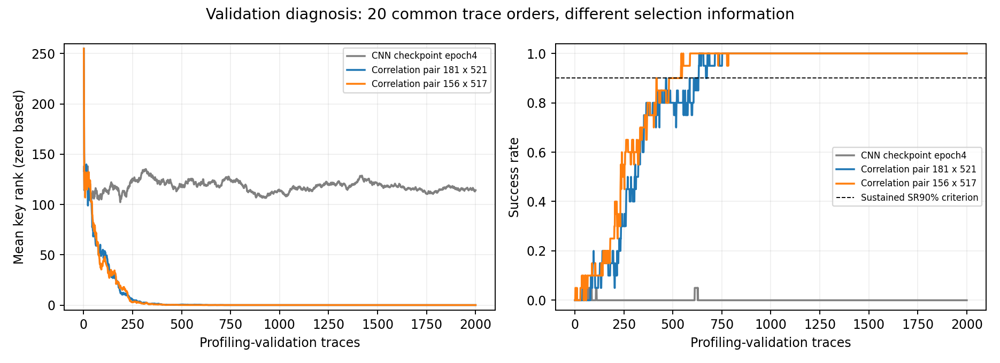
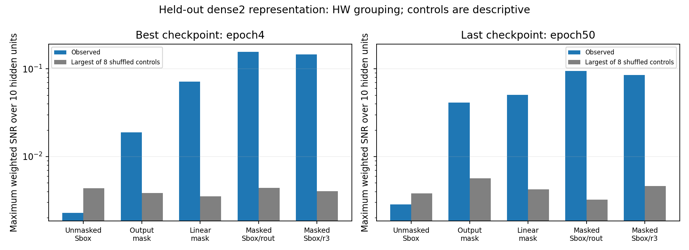

# Διάγνωση του τρίτου CNN baseline — 4 Οκτωβρίου 2026

**Βρέθηκε αξιοποιήσιμη διαρροή στο ίδιο profiling validation:** συσχέτιση δεύτερης
τάξης ανέκτησε το σωστό AES byte σε20/20 επαναλήψεις με budget2.000 traces.
Αυτό συνέβη και για τα δύο ζεύγη σημείων που είχαν ήδη επιλεγεί από τα training rows.
Το CNN παραμένει στο0/20. Δεν έγινε νέο Kaggle run, νέα εκπαίδευση ή final attack evaluation.

## Ανάκτηση με έναν στατιστικό διαγνωστικό έλεγχο

Η masking υλοποίηση χρησιμοποιεί τυχαίες μάσκες. Μεμονωμένες μετρήσεις μπορεί
να περιέχουν πληροφορία για τη μάσκα ή για τη masked τιμή, ενώ ο στόχος του CNN
είναι η unmasked έξοδος του AES Sbox. Εδώ συνδυάσαμε δύο μετρήσεις ανά trace:

`product = (trace[i] − training_mean[i]) × (trace[j] − training_mean[j])`.

Για καθεμία από τις256 υποθέσεις του key byte υπολογίσαμε τη συσχέτιση του
product με το Hamming weight του `Sbox(plaintext_byte XOR candidate_key)`.
Hamming weight σημαίνει αριθμός των bits που έχουν τιμή1. Η βαθμολογία είναι
η απόλυτη Pearson συσχέτιση. Το πραγματικό key χρησιμοποιείται μόνο για τη
μέτρηση του rank, όχι για παραγωγή των256 βαθμολογιών.

| Προκαθορισμένο ζεύγος, zero-based | GE@2.000 | SR@2.000 | Traces για sustained SR≥90% |
|---|---:|---:|---:|
|181×521, rout family|0|20/20|631|
|156×517, r3 family|0|20/20|481|
|CNN minimum-CE checkpoint, epoch4|114,25|0/20|δεν επιτεύχθηκε|

Τα20 trace orders είναι κοινά με το CNN: seed8001, pool5.000, budget2.000.
Το sustained criterion απαιτεί SR≥90% από το αναφερόμενο trace count μέχρι το2.000,
όχι ένα προσωρινό πέρασμα του ορίου. Τα orders επαναχρησιμοποιούν τον ίδιο pool·
δεν είναι20 ανεξάρτητες συλλογές δεδομένων.

Οι δύο επιλογές προέρχονται από την προηγούμενη training-only
[διάγνωση masking](../masking_diagnosis_2026-10-03/REPORT_EL.md). Δεν έγινε αναζήτηση
ζεύγους στο validation. Και το centering υπολογίστηκε μόνο από τα10.000 training rows.
Η επιλογή σημείων χρησιμοποίησε γνωστό training mask/share metadata· η συσχέτιση
στο validation χρησιμοποιεί μόνο traces και plaintext. Άρα η γραφική σύγκριση
είναι διαγνωστική: οι μέθοδοι έχουν διαφορετική πληροφορία στην επιλογή features.
Δεν είναι ελεγχόμενη σύγκριση ίδιου training protocol ή κόστους μάθησης.

Με8 shuffled-product controls ανά ζεύγος, το SR@2.000 ήταν0–10% για rout και
0–5% για r3, έναντι100% με τα σωστά συζευγμένα traces/plaintexts.
Τα controls είναι περιγραφικά και δεν χρησιμοποιούνται ως p-values ή confidence intervals.

## Τι έμαθε το CNN

Τα παρακάτω είναι νέα **fixed-checkpoint forward measurements** με eval mode.
Δεν είναι τα online training losses του ιστορικού epoch loop, όπου βάρη και
BatchNorm batch statistics αλλάζουν κατά τη διάρκεια της epoch.

| Checkpoint | Training CE / accuracy | Validation CE / accuracy |
|---|---:|---:|
|best, epoch4|5,516667 /0,96%|5,560782 /0,44%|
|last, epoch50|5,240488 /2,50%|5,814250 /0,44%|

Το training-only class-frequency reference έχει validation CE5,557023.
Η ομοιόμορφη πρόβλεψη έχει CEln(256)=5,545177. Όλες οι256 training classes
είναι παρούσες, με22–56 traces ανά class.

Στην epoch50, η σωστή αντιστοίχιση logits/labels βελτιώνει το training CE κατά
0,559119 σε σχέση με τον μέσο32 shuffled-label controls. Στο validation η
αντίστοιχη διαφορά είναι−0,000760, μέσα στο shuffled CE range5,792169–5,856998.
Για το best checkpoint, το validation alignment gain είναι μόλις0,001324,
επίσης μέσα στο shuffled range. Το σταθερό μέσο training prediction distribution
δίνει validation CE5,550784/5,556097 για best/last, χαμηλότερο από τις εξαρτώμενες
από το trace προβλέψεις τους. Αυτά υποστηρίζουν ανεπαρκή γενίκευση του target.

Οι10 μονάδες και των δύο hidden layers μεταβάλλονται με το input. Η μέση
validation logit standard deviation είναι0,1503 στο best και0,7339 στο last.
Δεν επαναλαμβάνεται το παλιό εύρημα πολλών μονίμως inactive ReLU μονάδων.

Στο dense2 validation, το HW(unmasked Sbox) έχει maximum SNR0,002268 στο best
και0,002833 στο last, κάτω από τα μέγιστα των shuffled controls0,004327/0,003810.
Αντίθετα, το HW(masked Sbox/rout) έχει SNR0,155188/0,094317 έναντι0,004397/0,003216.
Η αναπαράσταση διατηρεί σαφές σήμα για masked shares και μάσκες, ενώ η κατάταξη
του unmasked target παραμένει ανεπαρκής. Το SNR δεν μετρά όλη τη μη γραμμική
πληροφορία του δικτύου και δεν αποδεικνύει ότι η αρχιτεκτονική αδυνατεί γενικά
να μάθει τον στόχο.

## BatchNorm και κανονικοποίηση

Η [τεκμηρίωση PyTorch2.8](https://docs.pytorch.org/docs/2.8/generated/torch.nn.BatchNorm1d.html)
ορίζει running mean/variance για eval mode και update με momentum.
Στην epoch4 είχαν γίνει316 updates με momentum0,01. Η αρχική τιμή των buffers
διατηρεί συντελεστή `0,99^316≈0,0418`. Ο λόγος `(running_var+eps)/(current_train_var+eps)`
είναι1,89–31,26 στα4 channels. Υπάρχει επομένως αισθητή πρώιμη απόκλιση.

Υπολογίσαμε ακριβή moments από τα training inputs με τα ίδια frozen weights και
αντικαταστήσαμε μόνο τα BN buffers σε ένα in-memory αντίγραφο. Στο best το
validation CE έγινε5,569355 και SR0/20. Στο last, όπου ο παραπάνω λόγος είναι
ήδη1,00045–1,04288, το CE έγινε5,814538 και SR επίσης0/20. Η παρέμβαση δεν
αποκατέστησε ανάκτηση. Τα clones δεν αποθηκεύτηκαν και τα original checkpoints
και model buffers διατηρήθηκαν αμετάβλητα.

Το MinMax επανυπολογίστηκε από τα training rows και συμφωνεί με τα saved statistics.
Μόνο0,00634% των validation sample values είναι εκτός του training range, με
συνολικά άκρα−0,2 έως1,1667. Δεν έγινε clipping ή validation refit.

Ο [κώδικας των συγγραφέων](https://github.com/gabzai/Methodology-for-efficient-CNN-architectures-in-SCA/blob/master/ASCAD/N0%3D0/cnn_architecture.py)
χρησιμοποιεί45k training rows, batch50 και OneCycle schedule με max LR0,005.
Το δικό μας run είχε10k, batch128 και σταθερό LR0,001. Αυτές είναι διαφορές που
μπορούν να επηρεάζουν τη μάθηση, όχι αποδεδειγμένη αιτία του failure ή εγγύηση
ότι μεγαλύτερο budget θα το διορθώσει.

## Επαλήθευση, όρια και κατάσταση

Πέρασαν37 tests, με14 γνωστά dependency warnings, σε24,54s. Οι4 νέοι έλεγχοι
καλύπτουν CE/shuffle direction, moments ανά channel, isolation των BN buffers
και prefix Pearson correlations/ties. Τα40 correlation endpoints ελέγχθηκαν
και με ξεχωριστό centered-dot-product τύπο. GE/SR και sustained criteria
επανυπολογίστηκαν από τα αποθηκευμένα ranks.

Το CPU best-CNN rank curve συμφωνεί με το GPU κατά99,9925% των40.000 θέσεων:
υπάρχουν3 διαφορετικά ενδιάμεσα ranks, ενώ το τελικό GE114,25/SR0 συμφωνεί.
Δεν ισχυριζόμαστε πλήρη bitwise συμφωνία CPU/GPU floating-point υπολογισμών.

Οι δύο κύριες διαγνωστικές εκτελέσεις χρειάστηκαν16,04s και18,24s σε CPU,
χωριστά από tests, verification, plotting και χρόνο ανάπτυξης. Παραμένουν
**3 πλήρη Kaggle trainings και1 notebook**. Training source hash:
`84eff3cde04c0e9a1756a3d29c44ec82e115a1a08575132686a02520333e2b5c`.

Το εύρημα αφορά clean profiling validation, ίδιο public fixed-key campaign και
training-selected σημεία. Δεν έχει ελεγχθεί robustness της συσχέτισης σε
noise/shift, final attack performance, νέο κλειδί ή άλλη συσκευή. Δεν αποτελεί
επιβεβαίωση της υπόθεσης ότι training augmentation βελτιώνει το CNN.

Το CNN gate παραμένει failed και το combined δεν εκτελείται. Η επιτυχία του
στατιστικού ελέγχου δεν αντικαθιστά το CNN gate. Μέσα στο αρχικό όριο4 GPU trainings
απομένει ένα, ενώ νέο baseline μαζί με combined θα χρειαζόταν δύο. Νέα αρχιτεκτονική,
budget ή αλλαγή ορίου απαιτεί συγκεκριμένο ερευνητικό λόγο και συμφωνία χρήστη.

Επόμενο χρήσιμο βήμα είναι CPU sensitivity audit στα ήδη επιλεγμένα ζεύγη, με
προκαθορισμένες corruptions και centering/points σταθερά. Έτσι μπορούμε να
τεκμηριώσουμε τα όρια της διαρροής πριν προτείνουμε άλλη νευρωνική εκπαίδευση.

Πλήρη αριθμητικά αρχεία: [diagnosis.json](diagnosis.json),
[second_order_correlation.json](second_order_correlation.json),
[correlation_verification.json](correlation_verification.json), [summary.json](summary.json).
