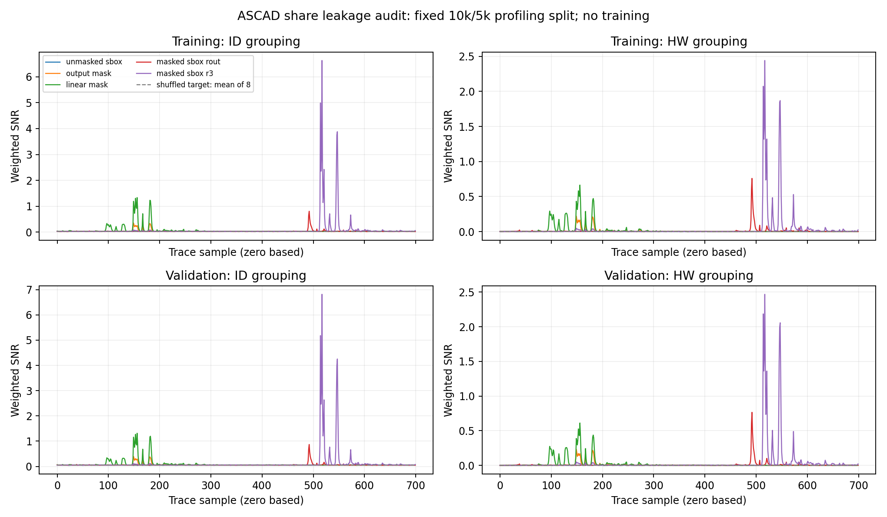
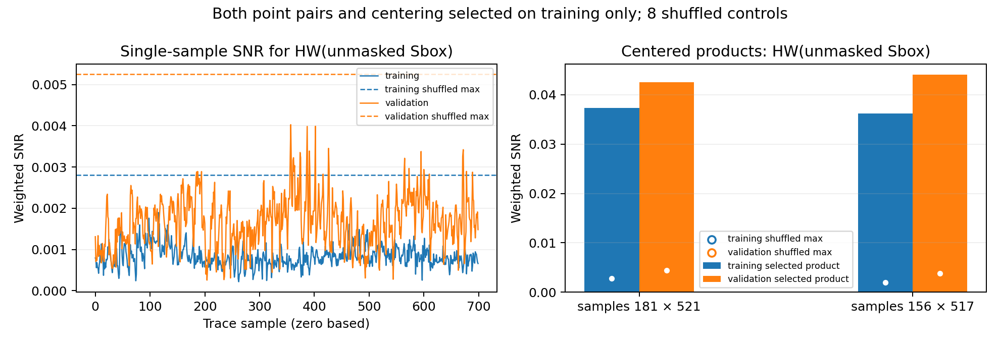

# Διάγνωση masking και αρχιτεκτονικής — 2026-10-03

Τα ASCAD traces περιέχουν χρήσιμη διαρροή στο σταθερό 10k/5k profiling split.
Τα δύο CNN baselines δεν τη γενίκευσαν. Η αλλαγή ReLU→LeakyReLU δεν ήταν αρκετή.
Η διάγνωση και το μη εκπαιδευμένο prototype χρησιμοποιούν μόνο CPU,
χωρίς optimizer step, νέα Kaggle εκτέλεση ή άνοιγμα του final attack group.
Παραμένουν **δύο πλήρη GPU trainings και ένα Kaggle notebook**.

## Τι μετρήσαμε

Ο επίσημος στόχος είναι `z=SBOX(plaintext[2] xor key[2])`· τα labels του συγκεκριμένου
split ελέγχθηκαν ξανά και συμφωνούν. Το ότι το AES είναι masked δεν καθιστά λανθασμένο
τον unmasked στόχο. [Επίσημος κώδικας labelization](https://github.com/ANSSI-FR/ASCAD/blob/master/ASCAD_generate.py).

Το ASCAD paper περιγράφει διαρροές των shares `z xor rout` / `rout` και
`z xor r[3]` / `r[3]`. Στο ASCADv1 metadata το `masks[0]` είναι το r[3]
της one-based σημειογραφίας και το `masks[15]` είναι το rout.
Οι πληροφορίες για αυτά περιλαμβάνονται στο παράθυρο των700 samples.
[ASCAD paper, §§2.5–2.6](https://eprint.iacr.org/2018/053.pdf).

Χρησιμοποιήσαμε weighted population SNR:
`Var(E[X|Y]) / E(Var(X|Y))`, με βάρη τις πραγματικές συχνότητες των κλάσεων.
Ο υπολογισμός έγινε χωριστά στα saved training10k / validation5k rows,
με ID256 και HW9 grouping. Τα metadata χρησιμοποιούνται αποκλειστικά στη διάγνωση,
ως γνωστά profiling labels· κανένα μοντέλο δεν παίρνει masks/key/plaintext ως input.

Σε μικρά δείγματα το εκτιμώμενο SNR έχει θετικό sampling background ακόμη και για
άσχετα labels. Κρατήσαμε οκτώ fixed shuffled-label controls, seed20261004, με ίδιες
class counts. Είναι περιγραφικοί έλεγχοι, όχι confidence interval ή formal p-value.

## Διαρροή στα ίδια traces

Όλες οι θέσεις είναι zero-based indices του700-sample trace.

| HW grouping / μέγιστο SNR | Training10k | Validation5k | Validation peak sample |
|---|---:|---:|---:|
| Unmasked z | 0,001897 | 0,004026 | 357 |
| rout | 0,221095 | 0,233213 | 149 |
| z xor rout | 0,759019 | 0,765717 | 492 |
| r[3] | 0,664110 | 0,611540 | 156 |
| z xor r[3] | 2,441193 | 2,467323 | 517 |

Το μέγιστο shuffled-control SNR για unmasked HW(z) είναι0,002801 στο training και
0,005249 στο validation, πάνω από τα αντίστοιχα observed maxima. Δεν εντοπίστηκε
σαφής first-order ένδειξη του unmasked target με αυτόν τον έλεγχο.
Στο ID grouping η observed peak SNR0,032345/0,068940 επίσης δεν ξεπερνά το
μέγιστο shuffled control0,035102/0,069785 για training/validation αντίστοιχα.
Τα mask/share peaks είναι πολύ μεγαλύτερα από τα δικά τους controls και εμφανίζονται
στις ίδιες θέσεις των δύο splits.

Επιλέξαμε πέντε separated points για κάθε mask/share από το training ID SNR,
με ελάχιστη απόσταση8 samples. Δοκιμάστηκαν25 centered products ανά οικογένεια.
Το ζεύγος και τα centering means επιλέχθηκαν αποκλειστικά στο training, με κριτήριο
το SNR ως προς HW(z). Το ίδιο προϊόν εφαρμόστηκε αμετάβλητο στο validation.

| Training-selected product | Training SNR | Validation SNR | Μέγιστο validation shuffled control, σε όλα25 products |
|---|---:|---:|---:|
| samples181×521 | 0,037290 | 0,042566 | 0,004420 |
| samples156×517 | 0,036232 | 0,044072 | 0,003810 |

Η ένδειξη διαρροής δεύτερης τάξης διατηρείται σε held-out profiling rows.
Δεν πρόκειται για trained classifier, δεν αξιολογήθηκε key rank από αυτά τα προϊόντα
και ο HW diagnostic στόχος δεν αντικατέστησε τις256 ID κλάσεις της μελέτης.
Δεν συμπεραίνουμε ότι μάθαμε να ανακτούμε το κλειδί ή ότι αποδείχθηκε μοναδική αιτία
της αποτυχίας του CNN.

## Τι μπορεί να συνδυάσει το CNN

Ο έλεγχος των πραγματικών layers δίνει receptive field11→12→32→34 input samples
στα conv1/pool1/conv2/pool2. Τα informative pairs απέχουν340 και361 samples.
Κανένα μεμονωμένο final convolutional feature δεν καλύπτει και τα δύο.
Όμως μετά το Flatten ο dense64 layer βλέπει **όλα700 samples** μέσω2800 features·
άρα το δίκτυο μπορεί θεωρητικά να συνδυάσει τις μακρινές περιοχές. Το local receptive
field δεν αποτελεί απόδειξη αδυναμίας ολόκληρου του μοντέλου.

Το ενεργό CNN έχει μόνο ένα nonlinear global hidden layer. Η scalar normalization
δίνει mean ανά sample από−1,950 έως1,880 και std από0,0231 έως0,2454· οι χρονικές
διαφορές του μέσου waveform είναι μεγάλες σε σχέση με τη μεταβολή ανά sample.
Αυτό δικαιολογεί έλεγχο άλλης conditioning/architecture, χωρίς να αποδεικνύει αιτία.

## Συγκεκριμένη υποψήφια συνέχεια, χωρίς εκτέλεση

Προετοιμάστηκε PyTorch prototype της μικρής synchronized-ASCAD αρχιτεκτονικής των
Zaid et al.: Conv4/kernel1, SELU, BatchNorm, AvgPool2, dense10, dense10, output256.
Έχει **16.952 parameters**, περίπου11,6 φορές λιγότερα από τα197.424 του δικού μας CNN.
Οι δύο global nonlinear hidden layers προσφέρουν διαφορετικό μηχανισμό σύνθεσης.
[Author code](https://github.com/gabzai/Methodology-for-efficient-CNN-architectures-in-SCA/blob/master/ASCAD/N0%3D0/cnn_architecture.py).

Το prototype ελέγχθηκε σε CPU με128 πραγματικά training traces: finite logits και
gradients, χωρίς optimizer step. Δεν υπάρχει evidence εκπαιδευμένης απόδοσης.
Έχει train-only per-position MinMax scaling, χωρίς clipping ή refit στο validation.
Η validation περιοχή[−0,20,1,1667] αναφέρεται ως παρατήρηση, όχι λόγος επαναπροσαρμογής.

Η προτεινόμενη εκτέλεση διατηρεί seed0, ίδιο10k/5k split,50 epochs/batch128/3.950steps,
Adam LR0,001 και unmasked ID target. Αλλάζει architecture/init/conditioning μαζί,
οπότε αποτελεί νέο baseline, όχι ablation ή ακριβή reproduction της δημοσίευσης.
Οι συγγραφείς χρησιμοποίησαν45k training traces, batch50 και OneCycle LR έως0,005·
δεν αναμένουμε αυτομάτως την επίδοσή τους στο δικό μας μικρότερο budget.
[Πρωτογενής εργασία, §5.2.3](https://eprint.iacr.org/2019/803.pdf).

Για το μικρότερο χρήσιμο επόμενο πλάνο προτείνεται **μία** τέτοια baseline εκπαίδευση
και, μόνο αν περάσει το validation review, **μία combined**. Μαζί με τα δύο failures:
έως4 πλήρη trainings και ένα notebook. Καταργούνται οι ξεχωριστές noise/shift συγκρίσεις.
Προτεινόμενο προκαθορισμένο gate: clean SR@2.000≥0,90, δηλαδή18/20 permutations,
με το checkpoint ελάχιστου validation CE· διαφορετικά σταματάμε πριν το combined.
Το ερώτημα τότε γίνεται baseline έναντι combined robustness· δεν επιτρέπει να
αποδώσουμε όφελος στον συνδυασμό έναντι κάθε single augmentation.
Αυτό είναι πρόταση, όχι εγκεκριμένο νέο scope ή ξεκινημένη εκτέλεση.

Το [AGENTS.md](../../AGENTS.md) ορίζει:
“Additional budgets, models or seeds require a research reason and user agreement.”
Η νέα αρχιτεκτονική και η μικρότερη σύγκριση χρειάζονται συμφωνία χρήστη πριν από training.

## Αναπαραγωγή και αρχεία

`notebooks/diagnose_masking.py`: profiling-only SNR / controls / train-selected products.
`notebooks/plot_masking_diagnosis.py`: γράφημα των αποθηκευμένων αποτελεσμάτων.
`notebooks/candidate_literature_cnn.py`: untrained model και train-only scaler.
`notebooks/audit_candidate_architecture.py`: shape/gradient/geometry/conditioning checks.
Αριθμητικά στοιχεία: [diagnosis.json](diagnosis.json), [architecture audit](architecture_audit.json),
[next-run proposal](next_run_proposal.json), [curves](snr_curves.npz).

Το SNR audit διήρκεσε16,44s σε CPU. Οι δύο υπάρχοντες checkpoint hashes έμειναν
αμετάβλητοι. `src/scripts/configs/pyproject.toml` και training fingerprint παρέμειναν
`6f72dd833c610ef73c9e1935dbd46b3acf245b3bf1910b9b80d09d3623d73126`.
Το ενεργό Kaggle notebook παραμένει στην αποθηκευμένη version6, baseline/epoch50 restore.
Τελικοί έλεγχοι:29 tests passed,14 warnings σε13,23s. Τα τρία νέα tests ελέγχουν
weighted SNR με hand calculation σε άνισες κλάσεις, separated point selection και
train-only scaling χωρίς clipping/refit στο validation.
Η suite περιλαμβάνει και τα υπάρχοντα μικρά synthetic CPU training tests για
correctness· αυτά δεν αποτελούν νέα φυσικά GPU πειράματα ή evidence key recovery.
