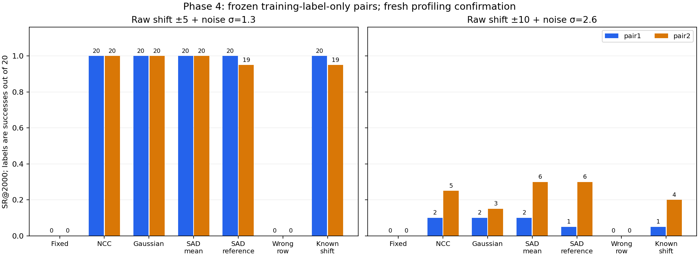

# SAD και έλεγχος σωστής αντιστοίχισης μετατόπισης — 2026-10-05

Η τέταρτη CPU φάση επιβεβαίωσε recovery **20/20 και 20/20** στη μέτρια raw αλλοίωση
με Gaussian, NCC και SAD training mean, στα δύο παγωμένα ζεύγη. Το όφελος χάθηκε
όταν τα ίδια Gaussian offsets αντιστοιχίστηκαν σε λάθος ίχνη: **0/20 και 0/20**.
Η γνωστή SAD μέθοδος ισοφάρισε τη Gaussian στο κύριο SR endpoint. Δεν προκύπτει
υπεροχή ή νέα τεχνική Gaussian alignment από αυτό το πείραμα.

## 1. Τι πάγωσε πριν την εκτέλεση

Ίδια original training10k/validation5k, ASCAD fixed-key, 700 samples, byte2.
Σημεία 156×521 και 182×547 από την προηγούμενη training-label-only επιλογή,
χωρίς νέο pair search ή fit σε confirmation. Unconditional training mean/variance.
Το νέο confirmation έχει 5.000 rows, seed20261008, αποκλείοντας train, validation
και τις τρεις προηγούμενες pools. Συνολικά 35.000 μοναδικά profiling rows καλύπτονται
από train/validation/τέσσερα confirmations. Απομένουν 15.000 profiling rows εκτός
αυτών των pools· δεν υποστηρίζεται ότι είναι άγνωστα σε κάθε ιστορικό schema diagnostic.
Το original Attack_traces payload δεν χρησιμοποιήθηκε στην επέκταση.

Κοινά 20 overlapping orders των 2.000 traces, seed8001, και ίδια U/Z seeds9101/2,
όπως πριν. Οι same-sized pools χρησιμοποιούν κοινά RNG streams, όχι ανεξάρτητες
corruption seeds. Τα trials αφορούν το ίδιο key byte, όχι 20 ανεξάρτητα κλειδιά.
RNG final states, draws, orders και hashes αποθηκεύτηκαν και επαληθεύτηκαν.

Search ±10, template window20:680, κοινή tie rule μικρότερου |shift| και negative
πριν positive. Τα scored samples είναι στο εσωτερικό και αποκλείουν το padding
για injected shifts έως±10. Zero/edge scores, estimates και products ήταν ίδια.

Raw S(x)+ε, uniform raw Gaussian σ=1,3 για combined5 και σ=2,6 για combined10_ood.
Αυτά παραμένουν διαφορετικά από το προηγούμενο normalized-space σ=0,1/0,2 protocol.
Δεν αυξήθηκε training budget, δεν έγιναν optimizer updates ή GPU εκτελέσεις.

## 2. Γνωστά baselines και counterfactual

- NCC και diagonal Gaussian: οι ακριβώς ίδιες frozen trace-only εκτιμήσεις.
- SAD training mean: ελάχιστο sum absolute difference ως προς το training mean.
- SAD reference: ίδια objective ως προς ένα training trace, επιλεγμένο χωρίς labels,
  key ή mask ως το πλησιέστερο στο mean με MSE στο fixed score window. Training
  index 549, profiling row 2409.
- Wrong row: deterministic roll κατά μία row των Gaussian-estimated offsets.
  Διατηρεί ακριβώς το histogram, αλλά διακόπτει την αντιστοίχιση trace/estimate.
  Diagnostic counterfactual, χωρίς χρήση των σωστών injected shifts στην κατασκευή του.
- Fixed και Known shift: χωρίς alignment και γνωστή synthetic μετατόπιση αντίστοιχα.
  Το known-shift SR δεν είναι αυστηρό άνω όριο σε πεπερασμένη noisy CPA.

Η SAD είναι κλασική objective, όπως περιγράφεται στην
[επίσημη τεκμηρίωση ChipWhisperer](https://chipwhisperer.readthedocs.io/en/latest/analyzer-api.html#chipwhisperer.analyzer.preprocessing.resync_sad.ResyncSAD).
Οι δύο δικές μας παραλλαγές κρατούν όλα τα traces, inclusive search bounds και κοινά
tie rules. **Δεν είναι exact ChipWhisperer package reproduction**, το οποίο χρησιμοποιεί
ένα reference trace και δικό του rejection/search handling. Δεν εγκαταστάθηκε package.
[Primary code και αναλυτικές διαφορές](../../literature/ALIGNMENT_BASELINES_2026-10-05.md).

## 3. Νέο confirmation, SR@2.000

Κάθε cell δείχνει pair1, pair2. Οι μέθοδοι δεν επιλέχθηκαν από τα αποτελέσματα.

| Συνθήκη | Fixed | NCC | Gaussian | SAD mean | SAD reference | Wrong row | Known shift |
|---|---:|---:|---:|---:|---:|---:|---:|
| Clean | 20/20, 20/20 | 20/20, 20/20 | 20/20, 20/20 | 20/20, 20/20 | 20/20, 20/20 | 20/20, 20/20 | 20/20, 20/20 |
| Shift ±5 | 0/20, 0/20 | 20/20, 20/20 | 20/20, 20/20 | 20/20, 20/20 | 20/20, 20/20 | 0/20, 0/20 | 20/20, 20/20 |
| Shift ±5 + σ=1.3 | 0/20, 0/20 | 20/20, 20/20 | 20/20, 20/20 | 20/20, 20/20 | 20/20, 19/20 | 0/20, 0/20 | 20/20, 19/20 |
| Shift ±10 + σ=2.6 | 0/20, 0/20 | 2/20, 5/20 | 2/20, 3/20 | 2/20, 6/20 | 1/20, 6/20 | 0/20, 0/20 | 1/20, 4/20 |

**Κύρια combined5 συνθήκη:**

| Μέθοδος | pair1 SR | pair1 GE | pair1 sustained SR90 | pair2 SR | pair2 GE | pair2 sustained SR90 |
|---|---:|---:|---:|---:|---:|---:|
| Fixed | 0/20 | 129,05 | >2000 | 0/20 | 144,20 | >2000 |
| NCC | 20/20 | 0,00 | 1028 | 20/20 | 0,00 | 1888 |
| Gaussian | 20/20 | 0,00 | 1019 | 20/20 | 0,00 | 1606 |
| SAD mean | 20/20 | 0,00 | 1023 | 20/20 | 0,00 | 1888 |
| SAD reference | 20/20 | 0,00 | 1023 | 19/20 | 0,05 | 1300 |
| Wrong row | 0/20 | 134,35 | >2000 | 0/20 | 133,45 | >2000 |
| Known shift | 20/20 | 0,00 | 1015 | 19/20 | 0,05 | 1893 |

Το predefined correspondence criterion επιτεύχθηκε: Gaussian SR≥0,90 σε κάθε pair,
βελτίωση≥0,10 έναντι wrong-row και clean Gaussian απώλεια≤0,10 έναντι fixed.
Gaussian clean SR20/20 και στα δύο. Το histogram μόνο του δεν διατηρεί το όφελος
όταν αφαιρεθεί η σωστή αντιστοίχιση στην παρούσα bounded synthetic-shift περίπτωση.
Αυτός ο αρνητικός έλεγχος δεν αποκλείει όλους τους πιθανούς alignment confounders.

SAD mean/NCC/Gaussian έχουν ίδια endpoint SR στη combined5, αλλά διαφορετικά prefix
thresholds. Η Gaussian φτάνει sustained SR90 στο pair2 στα1.606 traces, SAD mean/NCC
στα1.888, SAD reference στα1.300 με endpoint19/20. Δεν επιλέγουμε εκ των υστέρων
ποιο metric ευνοεί ποια μέθοδο· δεν παρουσιάζεται γενικός ισχυρισμός υπεροχής.

Στο OOD όλες οι πρακτικές μέθοδοι απέτυχαν στο threshold18/20: Gaussian **2/20,3/20**,
NCC **2/20,5/20**, SAD mean **2/20,6/20**, SAD reference **1/20,6/20**.
Η ύπαρξη περίπου93% ακριβών shifts δεν συνεπάγεται ότι το noisy second-order feature
αρκεί για recovery· alignment και feature SNR δεν είναι η ίδια μέτρηση.

## 4. Ακρίβεια εκτίμησης και καταγεγραμμένο κόστος

Confirmation combined5:

| Εκτιμητής | Ακριβές injected shift | MAE (samples) | Χρόνος για 5k (s) | μs/trace |
|---|---:|---:|---:|---:|
| NCC | 92,82% | 0,0718 | 0,6571 | 131,41 |
| Gaussian | 92,74% | 0,0726 | 1,0238 | 204,75 |
| SAD mean | 92,78% | 0,0722 | 0,5952 | 119,04 |
| SAD reference | 92,60% | 0,0740 | 0,6015 | 120,30 |

Wrong-row shift accuracy 8,42%,
Gaussian 92,74%.
Οι χρόνοι είναι **μία inference call για 5k traces** ανά μέθοδο/condition, σε fixed
σειρά μέσα στην ίδια CPU εκτέλεση. Δεν περιλαμβάνουν edge replay, I/O, CPA, setup ή
όλη τη συνεδρία. Δεν μετρήθηκαν repeated timing variance, ανεξάρτητοι devices ή
συμμετρικό warm-up· δεν προκύπτει σταθερό speedup από αυτά τα τέσσερα timings.

Phase4 experiment loop: **136,87s** μετά imports. Ανεξάρτητος verifier:
5,90s. Τέσσερις CPU experiment loops συνολικά
724,71s, ξεχωριστά από tests/reports/verifiers.
Full suite **61 passed / 14 υπάρχοντα warnings** σε 14,88s.
Η νέα φάση ελέγχθηκε στο ενεργό venv· το προηγούμενο clean CPU replay κάλυπτε το παλιό suite44.

## 5. Επαλήθευση και σχέση με paper

112 νέες recovery summaries, 2.240 ανεξάρτητα Pearson endpoints κατά εκτέλεση και
112 πρόσθετα endpoint replays από άλλη υλοποίηση. Ελέγχθηκαν ανεξάρτητα 256 sampled
shift estimates, πλήρη GE/SR/sustained summaries, disjoint splits/seed replay,
training-only reference, frozen pairs, RNG draws/orders/final states και exact rolled
histograms. Σύνολο τεσσάρων φάσεων: **400 summaries και 8.000 execution endpoint checks**,
με τα112 επιπλέον replays καταγεγραμμένα χωριστά.

Source84eff…, checkpoints, datasets, αρχικά splits, active Input και μοναδικό canonical
Kaggle notebook διατηρήθηκαν με hashes. Σύνολο GPU trainings3, νέα0, cap4, CNN gate
failed/combined skipped. Καμία νέα πραγματική optimizer ενημέρωση, final attack reads0
από αυτή τη φάση. Το νέο confirmation είναι πλέον viewed evidence και δεν
επαναχρησιμοποιείται ως αθέατο για μελλοντικές επιλογές.

Η τέταρτη φάση ενισχύει την ερμηνεία ότι η σωστή αντιστοίχιση shift/trace έχει
πρακτική σημασία και ότι το αποτέλεσμα της phase3 επαναλήφθηκε με frozen pairs.
Παράλληλα περιορίζει την υπόθεση Gaussian advantage: μια γνωστή SAD objective
ισοφαρίζει το primary endpoint. Πρόκειται ακόμη για same-key/campaign case study,
με global synthetic shifts και noise, όχι φυσικό local jitter ή unknown-key transfer.
Το [Second-order Scatter Attack, §1.1](https://eprint.iacr.org/2019/345.pdf) ήδη
διακρίνει τις απλές global μετατοπίσεις από elastic misalignment/shuffling.
Δεν εκτελέστηκε Scatter/DTW και δεν τεκμηριώθηκε νέο βιβλιογραφικό κενό.

Επόμενο: διαμόρφωση ανεξάρτητης campaign/key αξιολόγησης και κατάλληλων ισχυρών
συγκρίσεων πριν από νέο claim. Δεν αλλάζουμε το final attack set σε tuning pool.
Τα τωρινά αποτελέσματα εντάσσονται στην πανεπιστημιακή εργασία· paper novelty
παραμένει ανεπιβεβαίωτη.

[Frozen plan](plan.json), [αποτελέσματα](results.json), [112 rows CSV](all_results.csv),
[reference provenance](reference.json), [ανεξάρτητη verification](verification.json),
[evidence](evidence.json), [report verification](report_verification.json),
[προηγούμενες τρεις φάσεις](../paper_extension_2026-10-05/REPORT_EL.md).
