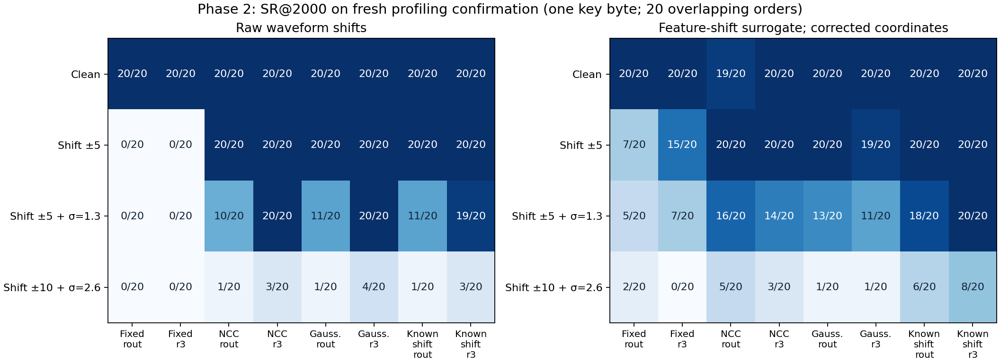
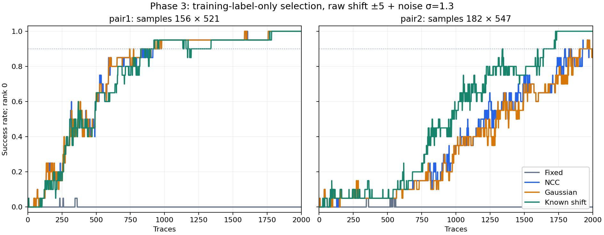

# Νέα πειράματα προς πιθανή δημοσίευση — 2026-10-05

Εκτελέστηκαν τρεις CPU φάσεις με πραγματικά ASCAD profiling traces και προκαθορισμένες
συνθετικές αλλοιώσεις. Η επιλογή σημείων μόνο από training labels, μαζί με εκτίμηση
μετατόπισης από το waveform, πέτυχε **20/20 και18/20** ανακτήσεις του byte στη συνθήκη
raw shift±5/θόρυβοςσ=1,3, έναντι **0/20 και0/20** χωρίς alignment. Το αυστηρότερο
shift±10/σ=2,6 παρέμεινε ανεπαρκές. Το θετικό αποτέλεσμα δεν τεκμηριώνει νέα τεχνική,
γενίκευση σε άλλη συσκευή ή ετοιμότητα paper.

Η επέκταση εγκρίθηκε από τον χρήστη στις5/10 για έρευνα και ένταξη στην τελική εργασία.
Το original augmentation CNN ερώτημα εξακολουθεί να μην έχει μετρηθεί: failed gate,
combined skipped, τρία υπάρχοντα GPU trainings, ένα Kaggle notebook.

## 1. Προοπτικό πρωτόκολλο και πληροφορία

ASCAD fixed-key,700 samples, zero-based byte2. Διατηρήθηκαν τα αρχικά10.000 training
και5.000 validation rows. Κάθε φάση πάγωσε δικό της plan/script hash πριν την εκτέλεση,
με νέο confirmation5.000 rows: seeds20261005,20261006,20261007. Οι τρεις pools είναι
αμοιβαία disjoint και χωριστοί από train/validation:30.000 μοναδικά profiling rows
συνολικά. Η official attack ομάδα δεν διαβάστηκε από αυτά τα νέα πειράματα.
Οι confirmation pools έχουν πλέον εξεταστεί· δεν θεωρούνται νέα αθέατη επιβεβαίωση
για επόμενες επιλογές. Η δεύτερη και τρίτη φάση προέκυψαν από ευρήματα της προηγούμενης,
και αποτελούν διαδοχική διερευνητική έρευνα, όχι μία ενιαία προεγγραφή.

Κοινά20 permutations/subsets των2.000 traces από κάθε pool5.000, seed8001. Είναι
επικαλυπτόμενες σειρές του **ίδιου key byte**, όχι20 ανεξάρτητα κλειδιά ή training seeds.
Δεν υπολογίζονται p-values ή ανεξάρτητες binomial confidence intervals.
Rank0=best, conservative absolute-correlation ties με ανοχή1e−12. SR90 σημαίνει
ότι SR≥0,9 διατηρείται σε όλα τα επόμενα prefixes μέχρι2.000· απουσία δηλώνεται censored.

Για alignment χρησιμοποιούνται μόνο traces: unconditional mean/diagonal variance
από train10k, NCC ή Gaussian score, candidates−10…10. Template columns20…679,
παρατηρούμενες columns10…689: κανένα padding sample δεν εισέρχεται στο score υπό
τις δοκιμασμένες πραγματικές shifts. Variance floor=max(median(train variance)×1e−6,1e−12).
Ties: μικρότερο|shift|, αρνητικό πριν θετικό. Το true injected shift χρησιμοποιείται
μόνο στο διαγνωστικό Known shift control και στη μέτρηση σφάλματος εκτίμησης.

Τα centered products βαθμολογούνται με absolute Pearson ως προς
HW(SBOX(plaintext_byte2 xor candidate_byte)). Τα plaintexts είναι δημόσιες
υποθέσεις αξιολόγησης· το σωστό key byte χρησιμοποιείται μόνο για rank/SR.
Δεν παρέχεται key, mask, plaintext ή label στον alignment estimator.

## 2. Θόρυβος και σειρά κανονικοποίησης

Ο scalerN(x)=(x−minimum)/scale προσαρμόζεται μόνο στα training traces, χωρίς clipping.
Median training feature range=13 raw units.
Οι τέσσερις συνθήκες είναι clean, shift±5, combined±5/σ=1,3 και combined±10/σ=2,6.
Ο θόρυβος είναι Gaussian **ομοιόμορφης raw-unit διασποράς**. Δεν είναι η παλαιότερη
feature-space σ=0,1/0,2 μετά το per-position MinMax· αυτά τα protocols δεν εξισώνονται.
U seed9101 καιZ seed9102 διατηρούνται κοινά ανά pool μεταξύ συνθηκών/μεθόδων.
Χρησιμοποιούνται τα ίδια RNG streams και στις ίσου μεγέθους pools: paired αλλοιώσεις,
όχι ανεξάρτητες corruption seeds. RNG states/draw hashes είναι στα verification records.

- Raw pipeline: S(x)+ε.
- Feature-shift surrogate: N⁻¹(S(N(x)))+ε. Δεν είναι φυσική μετατόπιση raw waveform.
- Affine transport S(N(x))×S(scale)+S(minimum)+ε επαναφέρει το raw pipeline
  με σφάλμα≤1e−10. Scalar affine normalization αντιμετατίθεται στο εσωτερικό.

Zero/edge padding έδωσαν ίδια selected products και shift estimates στις τρεις φάσεις.
Αυτό ελέγχει τους συγκεκριμένους εσωτερικούς estimators/features· δεν αποδεικνύει
γενική CNN border invariance. Ο known-shift έλεγχος δεν αποτελεί αυστηρό άνω όριο SR:
το τέλειο synthetic alignment δεν μεγιστοποιεί υποχρεωτικά την πεπερασμένη noisy CPA.

## 3. Φάση1: frozen παλαιά σημεία και πρώτος έλεγχος

Χρησιμοποιήθηκαν τα παλιά181×521(rout),156×517(r3), επιλεγμένα παλαιότερα μόνο στο
training αλλά με πρόσβαση σε mask/share metadata. Στο πρώτο confirmation, raw combined5
Gaussian SR=20/20 και20/20
για rout/r3, έναντι0/20 και0/20 fixed. Το υπάρχον CNN minimum-CE checkpoint είχε
clean confirmation GE112/SR0/20, χωρίς εκπαίδευση.

Η αρχική surrogate σύγκριση βαθμολόγησε και τις δύο pipelines στο raw training
σύστημα. Αυτό αναμειγνύει normalization order με λάθος centering/scales του
μετατοπισμένου normalized σήματος. Το surrogate known-shift0/20 δεν ερμηνεύεται
ως αδυναμία που παραμένει με σωστή εξαγωγή. Το αρχικό αποτέλεσμα διατηρείται ως
έλεγχος λανθασμένων συντεταγμένων, και διορθώθηκε προοπτικά στη φάση2.

## 4. Φάση2: σωστές συντεταγμένες και δεύτερο confirmation

Raw scoring στο raw training domain. Surrogate scoring στο N(observation),
με mean/variance και product centers από N(training). Ίδιο search/μέθοδοι/παλιά
σημεία· νέα poolseed20261006, χωρίς fit ή επιλογή σε προηγούμενο confirmation.

**Raw pipeline, SR@2.000:**

| Συνθήκη | Fixed rout | Fixed r3 | NCC rout | NCC r3 | Gaussian rout | Gaussian r3 | Known shift rout | Known shift r3 |
|---|---:|---:|---:|---:|---:|---:|---:|---:|
| Clean | 20/20 | 20/20 | 20/20 | 20/20 | 20/20 | 20/20 | 20/20 | 20/20 |
| Shift ±5 | 0/20 | 0/20 | 20/20 | 20/20 | 20/20 | 20/20 | 20/20 | 20/20 |
| Shift ±5 + σ=1.3 | 0/20 | 0/20 | 10/20 | 20/20 | 11/20 | 20/20 | 11/20 | 19/20 |
| Shift ±10 + σ=2.6 | 0/20 | 0/20 | 1/20 | 3/20 | 1/20 | 4/20 | 1/20 | 3/20 |

**Feature-shift surrogate, corrected coordinates, SR@2.000:**

| Συνθήκη | Fixed rout | Fixed r3 | NCC rout | NCC r3 | Gaussian rout | Gaussian r3 | Known shift rout | Known shift r3 |
|---|---:|---:|---:|---:|---:|---:|---:|---:|
| Clean | 20/20 | 20/20 | 19/20 | 20/20 | 20/20 | 20/20 | 20/20 | 20/20 |
| Shift ±5 | 7/20 | 15/20 | 20/20 | 20/20 | 20/20 | 19/20 | 20/20 | 20/20 |
| Shift ±5 + σ=1.3 | 5/20 | 7/20 | 16/20 | 14/20 | 13/20 | 11/20 | 18/20 | 20/20 |
| Shift ±10 + σ=2.6 | 2/20 | 0/20 | 5/20 | 3/20 | 1/20 | 1/20 | 6/20 | 8/20 |

Το πρώτο raw20/20 και στα δύο ζεύγη **δεν επαναλήφθηκε**: Gaussian combined5
στο δεύτερο confirmation=11/20,
20/20.
Το προκαθορισμένο κριτήριο≥18/20 και στα δύο αποτυγχάνει. Η διόρθωση στο surrogate
δίνει known-shift18/20,20/20 αντί της αρχικής raw-coordinate αποτυχίας· διαφορετικές
pools δεν επιτρέπουν καθαρή αριθμητική before/after αιτιώδη σύγκριση.

Παραμένουν διαφορετικά αποτελέσματα μεταξύ pipelines. Στο combined5 η Gaussian
εκτίμηση shift είναι ακριβής στο92,94% των raw traces έναντι66,52% surrogate.
Η σύγκριση περιλαμβάνει το waveform/scale/noise interaction που ορίζει κάθε pipeline·
δεν αποδεικνύει μόνο έναν απομονωμένο παράγοντα ούτε εξηγεί το **clean CNN failure**,
όπου η injected shift είναι μηδενική.

## 5. Φάση3: επιλογή μόνο με training labels

Η επιλογή χρειάζεται τα ίδια10k training traces και τα παρεχόμενα identity labels·
δεν διαβάζει training key/mask/share metadata. ΣτόχοςHW(identity label), absolute
Pearson του train-centered product για όλα τα211.575 eligible pairs με απόσταση≥50
samples. Επιλέγεται το μέγιστο και δεύτερο με κάθε point≥20samples από τα δύο πρώτα.
Constraints/ties πάγωσαν πριν την επιλογή· δεν χαλαρώθηκαν μετά validation.
Τρία matrix products υπολογίζουν τις coefficients, χωρίς optimizer updates.

Επιλέχθηκαν **156×521(pair1)** και **182×547(pair2)**. Training correlations
-0,198491 και-0,164445.
Η επιλογή αποθηκεύτηκε πριν διαβαστούν validation/confirmation payloads.
Χρόνος υπολογισμού επιλογής0,410s, όχι συνολικό I/O.
Υπάρχει supervised feature engineering και HW objective· δεν τεκμηριώνεται γενική
υπεροχή αυτής της CPA έναντι του CNN identity objective.

**Νέο confirmation seed20261007, raw pipeline:**

| Συνθήκη | Fixed pair1 | Fixed pair2 | NCC pair1 | NCC pair2 | Gaussian pair1 | Gaussian pair2 | Known shift pair1 | Known shift pair2 |
|---|---:|---:|---:|---:|---:|---:|---:|---:|
| Clean | 20/20 | 20/20 | 20/20 | 20/20 | 20/20 | 20/20 | 20/20 | 20/20 |
| Shift ±5 | 0/20 | 0/20 | 20/20 | 20/20 | 20/20 | 20/20 | 20/20 | 20/20 |
| Shift ±5 + σ=1.3 | 0/20 | 0/20 | 20/20 | 18/20 | 20/20 | 18/20 | 20/20 | 20/20 |
| Shift ±10 + σ=2.6 | 0/20 | 0/20 | 8/20 | 0/20 | 6/20 | 0/20 | 4/20 | 1/20 |

**Κύρια combined5 συνθήκη σε2.000 traces:**

| Μέθοδος | pair1 SR | pair1 GE | pair1 sustained SR90 | pair2 SR | pair2 GE | pair2 sustained SR90 |
|---|---:|---:|---:|---:|---:|---:|
| Fixed | 0/20 | 65,00 | >2000 | 0/20 | 62,65 | >2000 |
| NCC | 20/20 | 0,00 | 915 | 18/20 | 0,10 | 1973 |
| Gaussian | 20/20 | 0,00 | 899 | 18/20 | 0,10 | 1998 |
| Known shift | 20/20 | 0,00 | 1195 | 20/20 | 0,00 | 1641 |

Το προκαθορισμένο κριτήριο Gaussian≥18/20, βελτίωση≥0,10 έναντι fixed και clean
υποβάθμιση≤0,10 επιτεύχθηκε σε αυτή την pool. Η ακριβής Gaussian shift εκτίμηση
ήταν92,44%. Στο δυσκολότερο OOD η Gaussian έδωσε **6/20 και0/20** και κανένα
ζεύγος δεν έφτασε sustained SR90. Δεν αλλάζουμε ένταση/ζεύγη για να κρύψουμε το όριο.
Η αλλαγή σημείων και η νέα confirmation pool δεν επιτρέπουν ισχυρισμό ότι η νέα
επιλογή είναι ανώτερη από την προηγούμενη σε κοινή ανεξάρτητη σύγκριση.

## 6. Επαλήθευση, αρχεία και πραγματικό κόστος

- 128+96+64=288 recovery summaries, συνολικά5.760 CPA endpoint ranks ελεγμένα
  με ανεξάρτητο Pearson κατά την εκτέλεση. Επιπλέον576 sampled trace-only estimates
  επαναϋπολογίστηκαν ανεξάρτητα, GE/SR/sustained summaries ελέγχθηκαν από τις curves.
- Train-label selection:13 πραγματικές training pair coefficients ελέγχθηκαν με
  ανεξάρτητο np.corrcoef, μαζί με maxima, constraints και disjoint seed replay.
- Full suite57 passed/14υπάρχοντα warnings σε19,43s,0failures/errors/skips.
  Συνθετικά fixtures ελέγχουν κώδικα· οι αποτελεσματικότητες παραπάνω χρησιμοποιούν
  πραγματικά traces με συνθετικές αλλοιώσεις.
- Μετρημένοι CPU experiment loops: 252,25s + 201,99s
  + 133,60s = **587,83s** (9,80min),
  μετά τις εισαγωγές βιβλιοθηκών. Δεν περιλαμβάνουν όλη τη συνεδρία, tests/report ή
  ανεξάρτητους verifiers. Καμία νέα Kaggle εκτέλεση, πραγματικά optimizer updates0.
- Source84eff…, best/last checkpoints, active Input/code packet και μοναδικό canonical
  notebook διατηρήθηκαν βάσει SHA256. Failed CNN gate/combined skipped διατηρούνται.

[Όλα τα288 αποτελέσματα CSV](all_results.csv), [machine-readable evidence](evidence.json),
[τελική επαλήθευση](verification.json). Φάσεις: [1plan](../paper_alignment_2026-10-05/plan.json),
[1results](../paper_alignment_2026-10-05/results.json),
[1verification](../paper_alignment_2026-10-05/verification.json),
[2plan](../paper_alignment_coordinates_2026-10-05/plan.json),
[2results](../paper_alignment_coordinates_2026-10-05/results.json),
[2verification](../paper_alignment_coordinates_2026-10-05/verification.json),
[3plan](../paper_maskfree_2026-10-05/plan.json),
[3selection](../paper_maskfree_2026-10-05/selection.json),
[3results](../paper_maskfree_2026-10-05/results.json),
[3verification](../paper_maskfree_2026-10-05/verification.json).

## 7. Τι σημαίνει για paper και τελική εργασία

Έχουμε τεκμηριωμένο όφελος απλών trace-only aligners για συγκεκριμένα second-order
features και bounded synthetic shifts, με επιβεβαίωση χωρίς mask-aided point selection,
αρνητικό OOD και διακύμανση μεταξύ pools. Αυτά προστίθενται στην τελική πανεπιστημιακή
εργασία. **Δεν έχουμε ακόμη τεκμηριωμένη δημοσιεύσιμη πρωτοτυπία.**

Το πρόβλημα position-wise normalization/misalignment είναι ήδη συζητημένο στο
[Krček et al., preprint2023/1100, §2/§5.1](https://eprint.iacr.org/2023/1100.pdf).
Second-order alignment έχει προηγούμενα, όπως το
[Second-order Scatter Attack2019](https://eprint.iacr.org/2019/345).
NCC/Gaussian templates, centered products και supervised feature selection δεν
παρουσιάζονται ως νέα τεχνική. [Βιβλιογραφικό audit και κενά](../../literature/PAPER_ALIGNMENT_AUDIT_2026-10-05.md).

Η επίδοση αφορά μία fixed-key campaign και ένα byte,700cropped samples, global
synthetic translations και προσθετικό Gaussian noise. Δεν έχει ελεγχθεί φυσικό
desynchronization, unknown-key/cross-device transfer, δεύτερο dataset, διαφορετικά
training seeds ή ισχυρά διαθέσιμα alignment baselines. Δεν ανακτήθηκε ολόκληρο AES key.

Επόμενο ερευνητικό βήμα: στοχευμένη primary comparison με υπάρχοντες second-order
aligners και προοπτικό πρωτόκολλο ανεξάρτητης campaign/key επιβεβαίωσης. Αν δεν υπάρχει
ουσιαστικό βιβλιογραφικό κενό, η κατεύθυνση παραμένει replication/robustness case study.
Ένα υπόλοιπο GPU training στοcap4 δεν αρκεί για νέο baseline+combined· δεν ξοδεύτηκε
χωρίς συγκεκριμένη υπόθεση. Το original final attack set παραμένει για frozen τελική
αξιολόγηση και δεν χρησιμοποιείται για τις επόμενες επιλογές.
