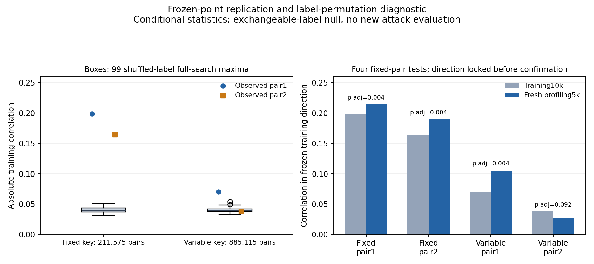

# Σταθερότητα επιλεγμένου σήματος και permutation audit — 6/10/2026

Τρία από τα τέσσερα παγωμένα ζεύγη επανέλαβαν signed συσχέτιση σε νέο disjoint profiling
confirmation5k, με το προκαθορισμένο corrected-p criterion. Και τα δύο fixed-key ζεύγη
και το πρώτο variable-key πέρασαν. Το δεύτερο variable-key δεν πέρασε:
rtrain=−0,037942, rconfirmation=−0,026326, pBonferroni=0,092. Δεν ισχυριζόμαστε ότι
η διαρροή του είναι μηδενική ή ότι αποδείχθηκε causal overfitting.

## 1. Παγωμένο scope και ανεξαρτησία δεδομένων

Το [plan.json](plan.json) γράφτηκε πριν από τη δοκιμή. Ίδια ιστορικά training10k/splitseed2026,
ίδια points156×521/182×547 για fixed-key και187×1080/334×573 για variable-key.
Δεν επιλέχθηκε άλλο ζεύγος, model, training budget ή normalization. Οι label permutations
είναι null diagnostics, όχι πρόσθετες training seeds ή νέα fitted attack models.

Νέα profiling confirmation5k ανά καμπάνια, seed20261010, αποκλείουν κάθε προηγούμενο
training/validation/confirmation index. Fixed-key αποκλείει35k, μετά έχει40k viewed/fit rows.
Variable-key αποκλείει15k profiling rows, μετά έχει20k. Οι αρχικές val pools και το evaluated
variable-key attack5k δεν ανακυκλώθηκαν. Καμία Attack_traces ή metadata/keys/masks/plaintext
ανάγνωση από αυτή τη φάση. Χρησιμοποιούνται traces και παρεχόμενα identity labels→HW.
Train means διατηρούνται για centered products στη confirmation, χωρίς refit.

Το [calibration.json](calibration.json) γράφτηκε πριν το
[confirmation access record](confirmation_access.json), με UTC/hash. Η προηγούμενη
αποτυχία έδωσε το διαγνωστικό ερώτημα· η νέα confirmation δεν χρησιμοποιείται για tuning
και δεν επαληθεύει νέους ισχυρισμούς αποτελεσματικότητας σε άγνωστο key.

## 2. Τυχαίο maximum μετά από πλήρη αναζήτηση

Με99 training-label permutations ανά καμπάνια, κάθε φορά υπολογίζεται maximum|Pearson|
σε όλους τους αρχικά επιλέξιμους centered-product συνδυασμούς:211.575 για fixed-key,
885.115 για variable-key. Mean/product variance είναι training-only και επαναχρησιμοποιούνται·
η label-dependent covariance επανυπολογίζεται. Border/separation domain και ties παραμένουν
ίδια με την παλιά επιλογή. Δεν συγκρίνουμε το observed selected score μόνο με null
ενός σταθερού pair, που θα αγνοούσε την προηγούμενη αναζήτηση.

Median null maximum:fixed=0.039628,
variable=0.039531.
Στο variable pair2,68/99 null maxima είναι τουλάχιστον όσο|rtrain| με tolerance1e−12,
άρα συντηρητικό tail=(68+1)/(99+1)=0,69. Το observed score βρίσκεται στη συνήθη
κλίμακα μεγάλων τυχαίων συσχετίσεων αυτής της αναζήτησης. Τα άλλα τρία scores είναι
μεγαλύτερα από τα99 null maxima, tail0,01 — το ελάχιστο διαθέσιμο με99 draws.

Αυτό είναι conditional global-no-association diagnostic υπό exchangeable labels,
όχι πιθανότητα ότι το pair2 είναι ψευδές, proof strong FWER υπό partial alternatives,
απόδειξη ότι δεν υπάρχει φυσική διαρροή ή adaptive selection rule για νέα μέθοδο.
Η diversity επιλογή του δεύτερου pair διατηρείται, ενώ το null threshold αφορά
συντηρητικά το global maximum, όχι ειδικό null για δεύτερη θέση.

## 3. Προοπτική επιβεβαίωση των ήδη επιλεγμένων σημείων

Στις φρέσκες profiling rows, statistic=correlation×sign(historical training r),
με direction παγωμένο πριν την ανάγνωση.999 common pairing permutations των labels,
ίδια indices και streams στις δύο ίσου μεγέθους καμπάνιες, όχι ανεξάρτητες training seeds.
Monte Carlo p=(1+count(null≥observed−1e−12))/(999+1). Διόρθωση Bonferroni για τέσσερις
προκαθορισμένους ελέγχους, pAdjusted=min(4p,1). Criterion:signedr>0 και pAdjusted≤0,05.

| Campaign / pair | Training r | Fresh confirmation r | Train max-null tail | Confirmation p adjusted | Criterion |
|---|---:|---:|---:|---:|---|
| fixed / pair1 | -0.198491 | -0.214335 | 0.01 | 0.004 | Πέρασε |
| fixed / pair2 | -0.164445 | -0.189627 | 0.01 | 0.004 | Πέρασε |
| variable / pair1 | -0.070405 | -0.105384 | 0.01 | 0.004 | Πέρασε |
| variable / pair2 | -0.037942 | -0.026326 | 0.69 | 0.092 | Δεν πέρασε |

Το raw p του variable pair2 είναι0,023, μετά τη διόρθωση0,092. Υπάρχει ασθενής
ίδιου προσήμου συσχέτιση στη νέα pool, αλλά δεν καλύπτει το προκαθορισμένο criterion.
Η παλαιότερη validation είχε σχεδόν μηδενική συσχέτιση· η διαφορά δεν επιτρέπει
επιλογή ευνοϊκής pool ή βεβαιότητα για απουσία σήματος. Τα τρία pAdjusted0,004
προέρχονται από raw0,001, το Monte Carlo floor, όχι ακριβή exhaustive p-values.

## 4. Τι προσθέτει στο ερευνητικό αποτέλεσμα

Η αναζήτηση επιβάλλει δύο pairs ακόμη και αν ένα δεύτερο score δεν ξεχωρίζει από
μεγάλα τυχαία maxima. Αυτό καταγράφει κίνδυνο επιλογής και άνιση signal replication,
όχι νέο αποτελεσματικό attack. Η φάση ελέγχει σταθερότητα του **επιλεγμένου σήματος**,
όχι spatial stability των argmax points σε πολλές ανεξάρτητες εκπαιδεύσεις.

Το variable pair1 επαναλαμβάνει συσχέτιση σε profiling, αλλά είχε ήδη αποτύχει στο
παγωμένο combined5 attack της προηγούμενης φάσης. Επομένως η αστάθεια του pair2
δεν επαρκεί μόνη της να εξηγήσει όλη την αποτυχία. Δεν απομονώθηκε αιτιωδώς noise,
timing variation, campaign ή key effect. Δεν αλλάζει το failed CNN gate, το GPU cap
ή το αρχικό αναπάντητο augmentation ερώτημα. Δεν υποστηρίζεται νέα τεχνική ή paper-ready claim.

## 5. Πηγές, επαλήθευση και πραγματικό κόστος

Pairing correlation permutations και +1 randomized correction τεκμηριώνονται στην
[επίσημη SciPy documentation](https://docs.scipy.org/doc/scipy/reference/generated/scipy.stats.permutation_test.html).
Χρησιμοποιείται δική μας NumPy υλοποίηση· δεν εκτελέστηκε SciPy permutation_test.
Η έγκυρη ερμηνεία προϋποθέτει random pairing/exchangeability, όχι ανεξαρτησία φυσικών
traces που αποδείχθηκε εδώ. Δεν έγινε stationarity audit κάθε acquisition sequence.
Ο [πρωτογενής έλεγχος πηγών/novelty](../../literature/SELECTION_AUDIT_2026-10-06.md)
καταγράφει τα όρια abstract-only ανάγνωσης και τα γνωστά προηγούμενα επιλογής σημείων.

[Ανεξάρτητη επαλήθευση](verification.json):598 πραγματικοί training/null coefficients,
6 sampled πλήρεις matrix-max επαναϋπολογισμοί, όλα τα3.996 confirmation-null coefficients,
και οι4 τελικές γραμμές/statistics/p-values. Επαληθεύτηκαν splits/disjointness,
όλες οι permutation indices/RNG final states, χρονική σειρά calibration/access,
old hashes/source/checkpoints/notebook/packets. Οι198 πλήρεις null maxima δεν
επανυπολογίστηκαν όλοι από δεύτερη matrix implementation:6 είναι ανεξάρτητα full-search
replays και τα υπόλοιπα ελέγχθηκαν στο αποθηκευμένο maximizing pair και στο frozen score.

Πέρασαν70tests/14 υπάρχονταwarnings, JUnit19.422s
(pytest console19,43s). Νέα GPU trainings0/optimizer updates0, συνολικάGPU3/cap4,
ένα Kaggle notebook, original gatefailed/combinedabsent. Actual CPU experiment
73.420532s μετάimports, verifier20.746923s. Περιλαμβάνει
calibration, confirmation, εγγραφές και preservation checks, όχι imports/tests/report/session.
Έξι CPU ερευνητικές φάσεις:recorded experiment loops
890.388246s. Τα recovery summaries παραμένουν448/8.960 execution
endpoints/160additional replays· οι τέσσερις νέες γραμμές είναι correlations, όχι νέες key recoveries.

Οι δύο νέες profiling confirmation pools είναι τώρα viewed evidence και αποκλείονται
από tuning. Τα παλαιά αποτελέσματα διατηρήθηκαν. Αν υπάρξει επόμενη μεθοδολογική
πρόταση, χρειάζεται ξεχωριστό frozen training-only σχέδιο και άλλη αχρησιμοποίητη
profiling επιβεβαίωση, χωρίς adaptation στο προηγούμενο attack subset.

Artifacts: [results.json](results.json), [arrays.npz](arrays.npz), [splits.npz](splits.npz),
[pytest.xml](pytest.xml). Ενσωμάτωση στη§15 της ενιαίας εργασίας.
