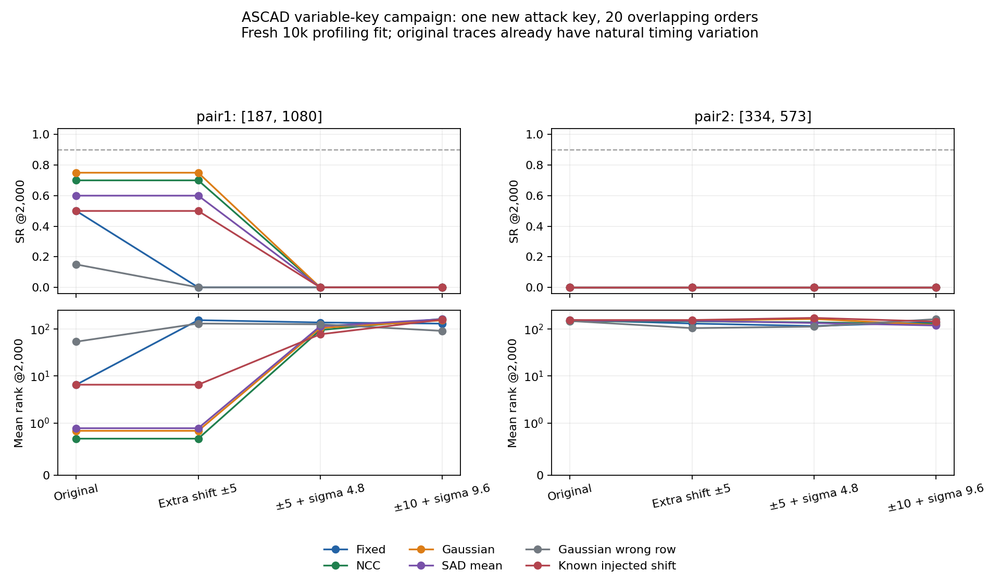

# Επιβεβαίωση CPU πρωτοκόλλου σε νέα ASCAD καμπάνια — 5/10/2026

Το παγωμένο πρωτόκολλο δεν κάλυψε το κριτήριο γενίκευσης σε νέα καμπάνια και νέο attack key.
Στη combined5 όλες οι έξι μέθοδοι έδωσαν **0/20 και στα δύο training-selected ζεύγη**.
Στα αρχικά δεδομένα χωρίς πρόσθετη αλλοίωση, το pair1 έδωσε Fixed10/20,
Gaussian15/20, NCC14/20 και SAD12/20· το pair2 απέτυχε παντού.
Οι20 σειρές είναι επικαλυπτόμενες επιλογές από το ίδιο pool5k, **ένα κλειδί και ένα training split**.
Οι παλαιότερες επιτυχίες στο fixed-key profiling παραμένουν καταγεγραμμένες,
αλλά δεν επαρκούν για γενικό ισχυρισμό robustness ή για paper νέας μεθόδου.

## 1. Πρωτογενής πηγή και πρόσβαση

Αποκτήθηκε μόνο το επίσημο αρχικό extracted variable-key αρχείο, όχι raw71GB,
πρόσθετα desync50/100 datasets ή pretrained CNNs. Οι δημιουργοί περιγράφουν αυτή την
καμπάνια ως ήδη ασυγχρόνιστη, με δύο τυχαία κλειδιά και μία σταθερού κλειδιού
καταγραφή ανά τρεις. Τα επίσημα [στοιχεία και checksum](https://github.com/ANSSI-FR/ASCAD/blob/master/ATMEGA_AES_v1/ATM_AES_v1_variable_key/Readme.md) και
οι [παράμετροι διαχωρισμού](https://github.com/ANSSI-FR/ASCAD/blob/master/ATMEGA_AES_v1/ATM_AES_v1_variable_key/example_generate_params)
ελέγχθηκαν στις5/10/2026. Το example αφορά desync100· το αρχείο εδώ είναι το original,
επαληθευμένο από το διαφορετικό επίσημο checksum του.

Το τοπικό αρχείο έχει 438,606,904bytes, profiling200k/attack100k,
1400int8 δείγματα/trace και identity labels για zero-based byte2, επαληθευμένα στις
επιλεγμένες training/evaluation rows. SHA-256:
`d834da6ca5a288c4ba5add8e336845270a055d6eaf854dcf2f325a2eb6d7de06`.
Το [download provenance](../../data/ASCAD_variable.provenance.json) αποθηκεύει URL,
bytes, UTC και πραγματικό χρόνο λήψης. Το αρχικό fixed-key αρχείο700samples διατηρήθηκε.

## 2. Προοπτικό πρωτόκολλο και περιορισμοί ερμηνείας

Το [plan.json](plan.json) παγώθηκε πριν την ανάγνωση τιμών: profiling10k training/5k validation,
splitseed2026, ξεχωριστό attack5k από100k με subsetseed20261009. Δεν υπάρχει νέα training
seed ή optimizer. Επιλογή δύο centered-product ζευγών με absolute Pearson προς
HW των παρεχόμενων training identity labels, separation50/diversity20. Εξαιρέθηκαν
προκαθορισμένα μόνο τα πρώτα/τελευταία10 σημεία για ασφαλή εξαγωγή υπό shifts±10:
885,115 υποψήφια ζεύγη. Training raw traces χωρίς προηγούμενο alignment.

Το [fit.json](fit.json) και το [fit.npz](fit.npz) γράφτηκαν πριν από το
[evaluation access record](evaluation_access.json): pairs [187, 1080],
[334, 573], raw unconditional training mean/diagonal variance,
floor=max(median variance×1e−6,1e−12). Δεν διαβάστηκαν keys/masks για fit/selection.
Η matrix επιλογή και εγγραφή fit χρειάστηκε 1.822257s, περιλαμβανόμενα
στο συνολικό χρόνο. Δεν πραγματοποιήθηκε fit μετά τη validation ή attack αξιολόγηση.

Πρόκειται για **επανάληψη του πρωτοκόλλου με νέο fit στην καμπάνια**, όχι zero-shot
μεταφορά των παλαιών σημείων ή CNN checkpoint. Οι1400samples προέρχονται από το νέο
επίσημο window· το frozen CNN700samples δεν χρησιμοποιήθηκε εδώ. Η νέα καμπάνια
αλλάζει μαζί με κλειδιά, φυσική χρονική μεταβλητότητα, window και fitting δεδομένα.
Δεν απομονώνεται αιτιωδώς η επίδραση μόνο της αλλαγής κλειδιού και δεν αποδεικνύεται
διαφορετική φυσική συσκευή. Τα δύο datasets ανήκουν στην ίδια οικογένεια υλοποίησης.

NCC/Gaussian/SAD mean: trace-only search±10 στο window20:1380, κοινό tie rule
μικρότερο|offset|/negative-first. Η SAD είναι η ήδη τεκμηριωμένη προσαρμογή, όχι νέα
τεχνική ή ακριβής αναπαραγωγή ChipWhisperer. Το wrong-row control διατηρεί histogram
και αλλάζει αντιστοίχιση. Το known injected shift αφαιρεί μόνο την πρόσθετη τεχνητή
μετατόπιση· η φυσική ασυγχρονία παραμένει άγνωστη, άρα δεν είναι πλήρες alignment oracle.

Training median range=48 raw units, συνεπώς σcombined5=4,8,
σOOD=9,6. Τα noise factors0,1/0,2 είναι ίδια με τις προηγούμενες φάσεις, αλλά οι απόλυτες
εντάσεις διαφέρουν από1,3/2,6. Δεν είναι πείραμα ίδιου απόλυτου θορύβου μεταξύ datasets.
Common U/Z seeds9101/9102 και κοινές20 σειρές με seed8001/budget2000. Gaussian raw noise
και επιπλέον global shifts είναι synthetic stress tests πάνω σε πραγματικές traces,
όχι πρόσθετες φυσικές λήψεις ή αναπαραγωγή elastic jitter/shuffling.

## 3. Τελική επίθεση στο νέο κλειδί

Στις αξιολογημένες attack5k rows βρέθηκε ένα σταθερό πλήρες AES key, διαφορετικό από
το αρχικό fixed-key· byte2=0x22. Το πλήρες κλειδί απουσιάζει από τις10k training rows,
που έχουν10.000 διαφορετικά πλήρη κλειδιά. Αυτό ελέγχθηκε **μετά** την εγγραφή fit.
Η μέθοδος δέχεται traces μόνο. CPA υποθέσεις HW(SBOX(plaintext2 xor candidate)) για
και τους256 candidates· αληθινό key byte μόνο για τελικό rank. Δεν χρησιμοποιήθηκε
key-adjusted plaintext ή simulated constant key. Μετράται ανάκτηση ενός byte.

SR@2000, συντηρητικό rank0=μοναδικά καλύτερο, tolerance1e−12:

| Μέθοδος | Clean pair1 / pair2 | Shift5 pair1 / pair2 | Combined5 pair1 / pair2 | OOD pair1 / pair2 |
|---|---:|---:|---:|---:|
| Fixed | 10/20 / 0/20 | 0/20 / 0/20 | 0/20 / 0/20 | 0/20 / 0/20 |
| NCC | 14/20 / 0/20 | 14/20 / 0/20 | 0/20 / 0/20 | 0/20 / 0/20 |
| Gaussian | 15/20 / 0/20 | 15/20 / 0/20 | 0/20 / 0/20 | 0/20 / 0/20 |
| SAD mean | 12/20 / 0/20 | 12/20 / 0/20 | 0/20 / 0/20 | 0/20 / 0/20 |
| Gaussian wrong row | 3/20 / 0/20 | 0/20 / 0/20 | 0/20 / 0/20 | 0/20 / 0/20 |
| Known injected shift | 10/20 / 0/20 | 10/20 / 0/20 | 0/20 / 0/20 | 0/20 / 0/20 |

Στη combined5 Gaussian GE=105.90/
164.55. Και τα δύο primary
criteria απέτυχαν: SR<0,90 και μηδενική SR βελτίωση από το fixed. Καμία γραμμή δεν φτάνει
sustainedSR90 εντός2.000 traces. Το clean15/20 στο pair1 δεν αλλάζει το primary endpoint.
Δεν επιλέχθηκε νέα μέθοδος/ζεύγος ή θόρυβος βάσει αυτών των αποτελεσμάτων.

## 4. Ανεξάρτητο profiling validation και μη διατήρηση της δεύτερης συσχέτισης

Τα validation keys μεταβάλλονται· χρησιμοποιήθηκαν μόνο descriptive correlations με
τα παρεχόμενα HW labels. Δεν συσσωρεύτηκαν ως μία επίθεση σε υποτιθέμενο σταθερό κλειδί.
Κάθε pair/μέθοδος διατηρήθηκε ανεξάρτητα από το validation αποτέλεσμα:

| Ζεύγος | Training correlation | Clean validation fixed | Clean validation Gaussian |
|---|---:|---:|---:|
| pair1 | -0.070405 | -0.097483 | -0.094365 |
| pair2 | -0.037942 | 0.001858 | 0.004488 |

Το pair2 έχει training|r|≈0,038 και σχεδόν μηδενική clean validation συσχέτιση.
Αυτό καταγράφει μη διατήρηση του selected signal εκτός training. Είναι συμβατό με
ασταθή επιλογή από πολλές candidates, αλλά δεν αποδεικνύει μόνο του causal overfitting,
μηδενική φυσική διαρροή ή αποτυχία κάθε second-order attack. Δεν αντικαταστάθηκε το pair2.

## 5. Επαλήθευση, κόστος και θέση στην εργασία

[Ανεξάρτητη επαλήθευση](verification.json):48 recovery summaries,48 validation
correlations,192 sampled shift estimates,7 πραγματικοί training pair coefficients,
48 επιπλέον endpoint replays. Κατά την εκτέλεση ελέγχθηκαν και οι960 CPA endpoints
με άλλο direct Pearson calculation. Splits/RNG/final states, timestamps fit/access,
train moments, point eligibility, key/labels και διατήρηση προηγούμενων artifacts ελέγχθηκαν.
Πλήρες suite:65passed/14 υπάρχονταwarnings, 18.031s.

Πριν από οποιαδήποτε real-data ανάγνωση, το νέο synthetic test εντόπισε slicing μόνο
ενός αντί δύο axes στην interior matrix. Διορθώθηκε· το αρχικό plan και το failed
test1failed/64passed διατηρούνται στο [correctness amendment](protocol_correctness_fix.json).
Το νέο plan άλλαξε script hash/UTC, χωρίς αλλαγή υπερπαραμέτρων ή viewed-data tuning.

CPU πείραμα 92.262550s μετά τα imports, verifier18.072197s,
λήψη168.660s. Το experiment time περιλαμβάνει fit και
εγγραφή/ελέγχους, όχι tests, imports, download, report ή session wall time.
Οι πέντε paper φάσεις έχουν448 recovery summaries,8.960 execution endpoint checks,
160 πρόσθετα replays και συνολικό recorded CPU experiment time
816.967715s. Δεν είναι448 ανεξάρτητα πειράματα/κλειδιά.
Νέα GPU trainings0/optimizer updates0, συνολικά GPU trainings3, ένα Kaggle notebook,
failed CNN gate και combined absent. Το αρχικό fixed-key Attack_traces payload δεν
διαβάστηκε σε αυτή την επέκταση· το νέο variable-key attack subset είναι πλέον
**viewed evidence** και δεν επιτρέπεται να χρησιμοποιηθεί για tuning επόμενης μεθόδου.

Το αποτέλεσμα ενσωματώνεται ως αρνητική επιβεβαίωση στη§14 της ενιαίας εργασίας.
Δεν υποστηρίζεται paper νέας Gaussian τεχνικής ή γενικής robustness υπεροχής.
Χρήσιμη συνέχεια είναι προοπτική εξέταση σταθερότητας/false selections μόνο σε νέα
profiling δεδομένα, με νέο παγωμένο πλάνο· η ήδη αξιολογημένη attack5k παραμένει εκτός tuning.

Πλήρη evidence: [results.json](results.json), [CSV48γραμμών](recovery_summary.csv),
[arrays.npz](arrays.npz), [pytest.xml](pytest.xml),
[πηγές/όρια](../../literature/VARIABLE_CAMPAIGN_2026-10-05.md).
