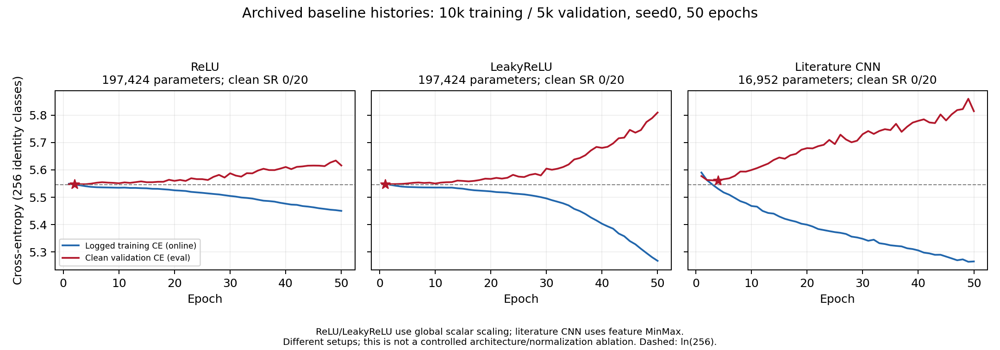
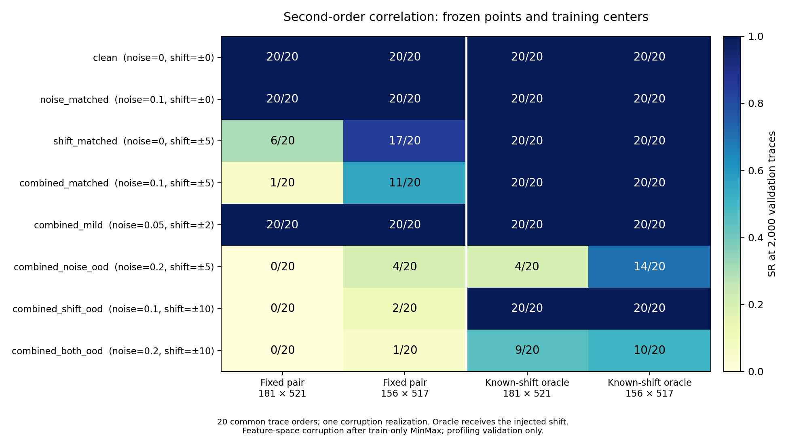

# Νευρωνικά δίκτυα και διαρροή masked AES: διαγνωστική μελέτη περιορισμένου κόστους

Προσωρινή ελληνική ερευνητική αναφορά για το μάθημα Hardware Security.
Κατάσταση: **2026-10-05**. Πρόκειται για σύνθεση των εκτελεσμένων πειραμάτων,
όχι για ολοκληρωμένη μελέτη augmentation ή επιβεβαιωμένη συνεισφορά paper.

## Περίληψη

Μελετήσαμε την ανάκτηση ενός AES key byte από δημόσιες πραγματικές μετρήσεις του
ASCAD fixed-key, με 10.000 training traces, 5.000 validation traces, ένα seed και
περιορισμό στις GPU εκπαιδεύσεις. Τρία CNN baselines ολοκλήρωσαν 50 epochs αλλά
δεν ανέκτησαν το byte σε καμία από τις 20 clean validation επαναλήψεις με budget
2.000 traces. Το προαποφασισμένο κριτήριο επιτυχίας απέτυχε, οπότε η εκπαίδευση
combined augmentation δεν εκτελέστηκε.

Οι CPU διαγνώσεις δείχνουν ότι η αποτυχία του τελευταίου CNN συνυπάρχει με αξιοποιήσιμη
δεύτερης τάξης διαρροή: correlation scoring σε δύο training-selected centered
products έδωσε 20/20 clean validation ανακτήσεις. Οι σταθερές θέσεις είναι ευαίσθητες
σε τεχνητές μετατοπίσεις. Με σ=0,1 και shifts±5 οι επιτυχίες πέφτουν σε1/20 και11/20·
γνωστή oracle διόρθωση επαναφέρει20/20. Αυτό είναι διαγνωστικό control, όχι πρακτική
ευθυγράμμιση. Οι μέθοδοι έχουν διαφορετική profiling information και δεν αποτελούν
δίκαιη σύγκριση υπεροχής CNN/correlation. Δεν χρησιμοποιήθηκε το τελικό attack set.

## 1. Στόχος και βασικές έννοιες

Ένα trace είναι η ακολουθία μετρήσεων φυσικής διαρροής κατά την εκτέλεση AES σε hardware.
Το νευρωνικό δίκτυο λαμβάνει μόνο αυτή την ακολουθία και προβλέπει256 πιθανότητες
για την τιμή ενός ενδιάμεσου byte. Το γνωστό plaintext επιτρέπει να μετατρέψουμε
αυτές τις πιθανότητες σε scores για256 υποψήφια key bytes. Η συσσώρευση πληροφορίας
από πολλά traces αποσκοπεί στο να φέρει πρώτο το σωστό byte. Δεν επιχειρούμε
ανάκτηση ολόκληρου του AES key.

Το masking χωρίζει την ευαίσθητη τιμή σε τυχαία καλυμμένες ποσότητες. Η σύνδεση
με το μη καλυμμένο byte μπορεί να απαιτεί συνδυασμό διαφορετικών χρονικών σημείων.
Ο έλεγχος δεύτερης τάξης εδώ χρησιμοποιεί προϊόν δύο κεντραρισμένων μετρήσεων.
Τέτοιες στατιστικές επιθέσεις έχουν ήδη μελετηθεί· δεν εισάγουμε νέα τεχνική.
[Prouff–Rivain–Bévan, revised primary record](https://eprint.iacr.org/2010/646).

Το αρχικό ερευνητικό ερώτημα ήταν: με λίγα μοναδικά training traces και κοινό αριθμό
updates, βοηθά ο συνδυασμός Gaussian noise και χρονικών μετατοπίσεων σε αλλοιώσεις
διαφορετικών εντάσεων; Αυτό παραμένει **αναπάντητο**, επειδή δεν υπάρχει trained
combined comparator. Το ερώτημα που εξετάζει αυτή η αναφορά είναι πιο στενό:
τι αποκαλύπτουν τα παγωμένα διαγνωστικά για τα αποτυχημένα CNN baselines και για
την ευαισθησία της υπάρχουσας διαρροής στις συγκεκριμένες αλλοιώσεις;

## 2. Δεδομένα, attacker και διαχωρισμός

Χρησιμοποιήσαμε το επίσημο προεπεξεργασμένο ASCAD fixed-key,700 samples ανά trace,
zero-based byte2, με identity labels `Sbox(plaintext[2] XOR key[2])`.
Η προέλευση και το schema ελέγχονται από το [επίσημο repository](https://github.com/ANSSI-FR/ASCAD).
Το τοπικό HDF5 έχει50.000 profiling και10.000 attack traces. Για το κύριο scope
επιλέξαμε10.000 training και5.000 validation rows από το profiling, splitseed2026.
Τα αποθηκευμένα indices είναι διακριτά και κοινά στα τρία baselines. Οι υπόλοιπες
profiling rows δεν αυξάνουν το εγκεκριμένο training budget.

Ο profiling attacker υποτίθεται ότι έχει γνωστές τιμές στην ελεγχόμενη profiling
συσκευή. Το CNN δεν λαμβάνει key, plaintext ή mask metadata ως inputs. Στο scoring
το plaintext χρησιμοποιείται για τις candidate hypotheses, το σωστό validation
key μόνο για το πραγματικό rank. Η παλιότερη επιλογή των correlation points
χρησιμοποίησε επιπλέον training mask/share metadata· αυτή η προνομιακή πληροφορία
καταγράφεται και δεν αποδίδεται στο CNN.

Το fixed-key campaign δεν αποδεικνύει μεταφορά σε νέο άγνωστο key ή άλλη συσκευή.
Το700-point window είναι ήδη προεπιλεγμένο από τους δημιουργούς του dataset.
Όλα τα κύρια αποτελέσματα αυτής της αναφοράς προέρχονται από **profiling validation**,
το οποίο έχει επανειλημμένα χρησιμοποιηθεί για διάγνωση. Δεν είναι ανεξάρτητο τελικό test.
Το final attack παραμένει κλειστό· δεν εμφανίζουμε validation scores ως attack results.

Dataset SHA-256: `f56625977fb6db8075ab620b1f3ef49a2a349ae75511097505855376e9684f91`.
Split ID: `1c9656f9ba13791a7ba4781a5518420f4fef4e303c979d4c307cc6ed27ee9090`.

## 3. CNN πρωτόκολλο και πραγματική εκτέλεση

Κάθε baseline χρησιμοποίησε seed0,50epochs,batch128,AdamLR0,001 και10k/5k split:
79updates ανά epoch,3.950 συνολικά. Το checkpoint επιλέχθηκε από την ελάχιστη
**clean validation cross-entropy**, πριν από τον έλεγχο ανάκτησης. Δεν επιλέγουμε
epoch από final attack ή αλλάζουμε τον κανόνα για να περάσει το gate.

| Baseline | Parameters | Κανονικοποίηση | Best epoch | Minimum validation CE | Clean GE@2000 | Clean SR@2000 |
|---|---:|---|---:|---:|---:|---:|
| ReLU |197.424|Training-only global scalar|2|5,547229|103,50|0/20|
| LeakyReLU0,1 |197.424|Training-only global scalar|1|5,547114|89,25|0/20|
| Literature-inspired CNN |16.952|Training-only feature MinMax|4|5,560782|114,25|0/20|

Το τελευταίο CNN έχει Conv1d1→4/kernel1,SELU/BatchNorm,AvgPool2 και dense10→10→256
logits. Τα ReLU/Leaky αποτελέσματα διατηρούνται ως αρνητικά αποτελέσματα. Η αλλαγή
normalization/architecture στην τρίτη έκδοση σημαίνει ότι η σύγκριση και των τριών
δεν απομονώνει την επίδραση ενός παράγοντα. Η μικρότερη CE ή GE ανάμεσα σε failures
δεν αρκεί για να ονομάσουμε ένα επιτυχές ή σταθερά ανώτερο μοντέλο.

Το gate για combined ήταν cleanSR≥0,90, δηλαδή18/20, στο original minimum-CE
checkpoint. Παρατηρήθηκε0/20. Το combined παραλείφθηκε, χωρίς single noise/shift
trainings ή αυτόματο search. Άρα δεν μετρήθηκαν augmentation effect, combined
overhead ή factorial interaction.



Οι καμπύλες training CE υπολογίστηκαν online μέσα στον training loop, ενώ validation
CE σε eval mode. Δεν είναι frozen-forward μέτρηση του ίδιου checkpoint στο training
set. Η ξεχωριστή CPU διάγνωση παρακάτω χρησιμοποιεί frozen-forward CE.
Η πτώση training CE και άνοδος validation CE είναι συμβατή με ανεπαρκή γενίκευση
του setup, αλλά δεν εντοπίζει από μόνη της μία μοναδική αιτία.

## 4. Ποια διαγνωστικά εκτελέστηκαν

Τα best/last checkpoints του literature CNN αξιολογήθηκαν σε CPU χωρίς νέα weight
updates. Η ελεγμένη, παγωμένη CE στο training ήταν5,516667 για best και5,240488
για last· στο validation5,560782 και5,814250. Έλεγχοι label shuffles έδειξαν
training alignment χωρίς αντίστοιχο held-out alignment. Οι10 dense μονάδες έχουν
μεταβλητά outputs, επομένως το τελευταίο failure δεν εξηγείται απλώς από πλήρη
σταθεροποίηση των outputs. Διατηρείται mask/share signal στη hidden representation,
ενώ η ένδειξη για τον unmasked στόχο παραμένει χαμηλή.

Ελέγχθηκε BatchNorm με training-only exact moments σε frozen-weight clones.
Δεν άλλαξαν τα αρχικά checkpoints. Η validation CE έγινε5,569355(best) και
5,814538(last), με SR0/20 και στα δύο. Αυτό αποκλείει ως επαρκή λύση τον συγκεκριμένο
BN recalibration έλεγχο· δεν αποκλείει κάθε πιθανή αλλαγή training recipe.

Στη δεύτερης τάξης διάγνωση επαναχρησιμοποιήθηκαν τα υπάρχοντα training-selected
ζεύγη181×521 και156×517, χωρίς validation point search. Τα προϊόντα συσχετίζονται
με `HW(Sbox(plaintext_byte XOR candidate_key))` για κάθε υποψήφιο byte.
Η απόλυτη Pearson correlation δίνει τη βαθμολογία. Τα true-key ranks,GE,SR και
sustainedSR90 προκύπτουν από20 κοινές σειρές των validation traces.

| Παγωμένο ζεύγος | Clean GE@2000 | Clean SR@2000 | Πρώτο sustainedSR90 prefix |
|---|---:|---:|---:|
|181×521 (rout)|0|20/20|631traces|
|156×517 (r3)|0|20/20|481traces|

Ο συνδυασμός διαρροών είναι αξιοποιήσιμος στο συγκεκριμένο validation. Δεν
συμπεραίνουμε ότι κάθε CNN αδυνατεί να τον μάθει, ότι correlation είναι καθολικά
ανώτερη ή ότι η επιτυχία θα μεταφερθεί σε νέο device/key. Τα δύο ζεύγη δεν
συνδυάστηκαν σε νέο classifier και δεν επιλέχθηκε validation winner.

## 5. Θόρυβος, shifts και oracle control

Οι οκτώ εντάσεις είχαν οριστεί στο υπάρχον evaluation grid. Χρησιμοποιήθηκαν
train-only feature MinMax,παγωμένα normalized training centers,seed9001,batch256,
shift→noise και20common orders/seed8001. Αυτό είναι **evaluation αλλοιώσεων**,
όχι single-strategy training. Κάθε κελί παρακάτω αναφέρει επιτυχίες/20 στο budget2000.

| Συνθήκη (σ; shift range) |Fixed181×521|Fixed156×517|Oracle181×521|Oracle156×517|
|---|---:|---:|---:|---:|
|Clean (0;0)|20/20|20/20|20/20|20/20|
|Noise matched (0,1;0)|20/20|20/20|20/20|20/20|
|Shift matched (0;±5)|6/20|17/20|20/20|20/20|
|Combined matched (0,1;±5)|1/20|11/20|20/20|20/20|
|Combined mild (0,05;±2)|20/20|20/20|20/20|20/20|
|Combined noise OOD (0,2;±5)|0/20|4/20|4/20|14/20|
|Combined shift OOD (0,1;±10)|0/20|2/20|20/20|20/20|
|Combined both OOD (0,2;±10)|0/20|1/20|9/20|10/20|

Το oracle διαβάζει τις θέσειςpoint+δ με τη **γνωστή injected μετατόπιση** του trace.
Δεν εκτιμά τη δ από μετρήσεις. Η επαναφορά σε20/20 για σ=0,1 είναι διαγνωστική
ένδειξη ότι η θέση των features περιορίζει τη σταθερή εξαγωγή. Δεν αποτελεί learned
shift invariance ή έτοιμη πρακτική επίθεση. Στο σ=0,2 ούτε η oracle εξαγωγή φτάνει
18/20. Δεν βελτιστοποιήθηκαν οι εντάσεις ή τα ζεύγη από τις τωρινές επιδόσεις.



Τα selected products είναι ακριβώς ίδια με zero και edge padding, καθώς τα σημεία
είναι εσωτερικά και κανένα δεν αποκόπηκε μέχρι±10. Αυτό δεν αποκλείει border cues
σε CNN που διαβάζει700points. Οι μετατοπίσεις/θόρυβος εφαρμόστηκαν **μετά** το
per-position MinMax και δεν ισοδυναμούν με physical raw jitter/noise πριν από αυτό.

Οι μέθοδοι μέσα σε κάθε συνθήκη έχουν ίδια corrupted traces. Οι σειρές traces
είναι κοινές σε όλες τις συνθήκες, αλλά το interleaved RNG δεν εγγυάται κοινά
offsets μεταξύ διαφορετικών συνθηκών. Για παράδειγμα, η διαφορά shift-only/combined
δεν απομονώνει αποκλειστικά τον θόρυβο. Δεν συμπεραίνουμε μονοτονική dose-response
από τις OOD διαφορές μίας corruption realization.

## 6. Μετρικές και αβεβαιότητα

Rank0 σημαίνει πρώτο υποψήφιο. GE είναι ο μέσος rank και SR το ποσοστό σειρών που
καταλήγουν στοrank0. Το CNN συσσωρεύει log probabilities. Η correlation χρησιμοποιεί
absolute prefix scores και συντηρητικά ties με tolerance1e−12. Οι δύο score methods
διαφέρουν και δεν συγκρίνονται ως CE. SustainedSR90 σημαίνειSR≥0,90 σε όλα τα
επόμενα prefixes μέχρι το budget, όχι μία μεμονωμένη πρώτη επιτυχία. Τα failures
καταγράφονται ως μη επίτευξη εντός2000, όχι ως πλασματική επιτυχία στα2000.

Οι20σειρές περιέχουν αλληλεπικαλυπτόμενα traces από κοινό pool· δεν είναι20training
seeds ή ανεξάρτητες φυσικές campaigns. Τα τρία CNNs έχουν ένα κοινό training seed,
όχι επαναλήψεις της ίδιας αρχιτεκτονικής. Δεν αναφέρουμε confidence intervals ή
μεταβλητότητα μεταξύ trainings,corruption seeds ή συσκευών που δεν μετρήθηκαν.
Τα label/product shuffle controls είναι περιγραφικά, όχι αυτόματοι p-values.

## 7. Βιβλιογραφία και τι μπορεί να θεωρηθεί συνεισφορά

Noise/shifting augmentation και τα όρια CNN shift robustness έχουν ήδη προηγούμενο.
Η εργασίαLi–Perin του2024 εξετάζει countermeasures χωριστά και αναφέρει joint
strategies ως future work· αυτό δεν πιστοποιεί σημερινό κενό.
[Publisher full text](https://link.springer.com/article/10.1007/s13389-024-00363-3).
Η εργασίαKrček et al. μελετά shift robustness και augmentation ensembles.
[Preprint](https://eprint.iacr.org/2023/1100.pdf),
[publisher record](https://www.mdpi.com/2227-7390/12/20/3279).

Το EquivSCA προσθέτει shift/temporal-scale equivariant αρχιτεκτονική με διαφορετικό
training/epoch-selection πρωτόκολλο. Το RFA-SCA χρησιμοποιεί unlabeled target
adaptation, δηλαδή διαφορετική πρόσβαση σε target data από τη δική μας.
[EquivSCA preprint](https://eprint.iacr.org/2025/1379.pdf),
[RFA-SCA publisher PDF](https://file.techscience.com/files/onlinefirst/2026/6.11/TSP_CMC_81308/TSP_CMC_81308.pdf).
Η σχέση centered products και ευθυγράμμισης επίσης έχει προηγούμενο.
[Second-order Scatter Attack](https://eprint.iacr.org/2019/345.pdf).

Η τρίτη CNN εκτέλεση είναι προσαρμογή της μικρής αρχιτεκτονικής τουZaid et al.,
όχι ακριβής αναπαραγωγή αποτελεσμάτων. Ο δημόσιος κώδικας ορίζει45ktrain/batch50/
OneCyclemaxLR0,005, ενώ εμείς10k/batch128/constantLR0,001. Από αυτά προκύπτουν
45.000 έναντι3.950updates για50epochs, περίπου11,39φορές λιγότεροι δικοί μαςupdates.
Αυτή είναι δική μας αριθμητική σύγκριση· δεν αποδεικνύει αιτία failure ή ότι περισσότερα
updates θα το διορθώσουν. Η training-only κανονικοποίηση διατηρείται.
[Author code](https://github.com/gabzai/Methodology-for-efficient-CNN-architectures-in-SCA/blob/master/ASCAD/N0%3D0/cnn_architecture.py).

Με τα σημερινά δεδομένα, η τεκμηριωμένη συνεισφορά είναι **αναπαραγώγιμη πανεπιστημιακή
μελέτη περίπτωσης**: negative CNN results, diagnostics και περιορισμοί συγκεκριμένου
feature-space corruption protocol. Δεν επιβεβαιώνεται νέα μέθοδος, όφελος augmentation
ή δημοσιεύσιμο ερευνητικό κενό. Ο [πίνακας βιβλιογραφίας](../../literature/REVIEW.md)
και ο [στοχευμένος έλεγχος της5/10](../../literature/PRIMARY_AUDIT_2026-10-05.md)
καταγράφουν authors/venue/DOI,πρόσβαση,διαφορές και εκκρεμότητες. Η αναζήτηση δεν ήταν
εξαντλητική· final chapters,code URLs και forward-citation gaps δεν ερμηνεύονται ως
απουσία εργασιών. Δεν αγοράστηκε πρόσβαση.

## 8. Πραγματικό κόστος και αναπαραγωγιμότητα

| Ολοκληρωμένο training | GPU | Epochs / steps | Training-loop seconds | Validation-loop seconds |
|---|---|---:|---:|---:|
|ReLU|TeslaT4|50/3.950|18,08|3,49|
|LeakyReLU|TeslaT4|50/3.950|19,11|3,93|
|Literature CNN|TeslaT4|50/3.950|14,85|3,42|
|Σύνολο|Ίδιος τύπος GPU|150/11.850|52,04|10,84|

Οι χρόνοι είναι synchronized epoch loops με transfers και augmentation, όχι πλήρες
Kaggle elapsed time. Δεν περιλαμβάνουν container startup, εγκαταστάσεις,ελέγχους,
HDF5 inspection και checkpoint I/O. Δεν ανασυνθέσαμε αξιόπιστο συνολικό κόστος όλων
των sessions από αυτούς τους αριθμούς. Ενδεικτικά η τελευταία εκτέλεση είχε log
μέχρι300,285s, με πολύ μεγαλύτερο setup κόστος από τον training loop. Οι πρώτες3
benchmark epochs του αρχικού baseline επαναχρησιμοποιήθηκαν στις50 και δεν
μετρήθηκαν ως πρόσθετο πλήρες training.

Η CPU sensitivity μέτρηση χρειάστηκε47,52s και η ανεξάρτητη επαλήθευση6,07s.
Αυτοί οι χρόνοι δεν προστίθενται σε GPU timings σαν κοινή compute σύγκριση.
Η παρούσα σύνθεση διαβάζει υπάρχοντα JSON/checksums, δεν ξανατρέχει εκπαίδευση
ή ανάκτηση. Συνολικά παραμένουν3πλήρη GPU trainings και1Kaggle notebook.
Ο source fingerprint είναι
`84eff3cde04c0e9a1756a3d29c44ec82e115a1a08575132686a02520333e2b5c`.

Το τελευταίο πλήρες suite είχε44tests passed/14υπάρχοντα deprecation warnings σε32,51s.
Οι CPU ranks επαληθεύτηκαν με ανεξάρτητο Pearson formula και production corruption
replay,640endpoints. Συνθετικά tests ελέγχουν κώδικα και όχι φυσική αποτελεσματικότητα.
Στη συνεδρία σύνθεσης δεν άλλαξαν labels/ranking/splits/transforms/checkpoints,
οπότε δεν δηλώνουμε νέα εκτέλεση του full suite. Ελέγχθηκαν απευθείας οι πίνακες,
οι πηγές τους και η διατήρηση των παγωμένων artifacts.

## 9. Συγκεκριμένη συνέχεια μέσα στο ισχύον όριο

Προτεινόμενη συνέχεια χωρίς νέα GPU εκπαίδευση: να χρησιμοποιήσουμε αυτή τη
διαγνωστική κατεύθυνση ως προσωρινό άξονα της πανεπιστημιακής εργασίας και να
ολοκληρώσουμε την αναπαραγωγή από καθαρό περιβάλλον, την ελεγμένη βιβλιογραφία και
την εξήγηση του threat model. Το αρχικό augmentation ερώτημα καταγράφεται ως
μη απαντημένο λόγω failed baseline gate· δεν αφαιρείται από το ιστορικό.

| Επιλογή συνέχειας | Πρόσθετα πλήρη GPU trainings | Τι μπορεί να απαντήσει | Κατάσταση |
|---|---:|---|---|
|Σύνθεση/αναπαραγωγή υπάρχοντων αποτελεσμάτων|0|Διαγνωστική μελέτη αυτού του setup και των ορίων του|Μέσα στο ισχύον scope· προτεινόμενη|
|Πρακτική ευθυγράμμιση από traces|0 κατ' αρχήν|Εκτίμηση shifts χωρίς γνωστήδ και diagnostic robustness|Δεν υλοποιήθηκε· απαιτεί ξεχωριστό παγωμένο πρωτόκολλο|
|Νέο CNN recipe baseline και conditional combined|1baseline +1combined αν περάσει|Αρχικό none/combined ερώτημα σε νέο setup|Σύνολο μπορεί να γίνει5· απαιτεί αλλαγή scope/ορίου και συμφωνία|

Απομένει μία πλήρης GPU εκπαίδευση κάτω από το cap4. Αυτό **δεν αρκεί** για νέο
baseline και επιτυχημένο conditional combined. Δεν υπάρχει έγκριση για νέο recipe,
model,data budget,seed ή αλλαγή checkpoint rule. Δεν ετοιμάστηκε ούτε υποβλήθηκε
νέο GPU run. Η recommendation είναι δική μας κρίση από τα ευρήματα, όχι κριτήριο
του καθηγητή ή εγγύηση αξιολόγησης. Δεν έχει δοθεί συγκεκριμένη ημερομηνία παράδοσης·
ο χρήστης ανέφερε διαθέσιμο εξάμηνο και απουσία κριτηρίων αξιολόγησης.

Για paper θα χρειαστεί να καθοριστεί ξεχωριστή νέα συνεισφορά και ισχυρότερη
επιβεβαίωση· η σημερινή αναφορά δεν προεξοφλεί τέτοιο αποτέλεσμα.

## 10. Αρχεία και επανάληψη της σύνθεσης

Η [evidence.json](evidence.json) συγκεντρώνει τους αριθμούς και SHA-256 κάθε
εισόδου. Ο companion `notebooks/build_study_synthesis.py` διαβάζει μόνο αποθηκευμένα
artifacts, επιβεβαιώνει50epochs/3.950steps,minimum-CE selections,archive hashes,
κοινά split/data identifiers και το failed gate, και δημιουργεί το γράφημα ιστοριών.
Δεν ανοίγει HDF5 trace groups, δεν επιλέγει νέο μοντέλο και δεν καλεί Kaggle.

```powershell
& .\.venv\Scripts\python.exe notebooks/build_study_synthesis.py
```

Αναλυτικά τεκμήρια:

- [ReLU training και validation](../kaggle_baseline_v3_2026-10-03/REPORT_EL.md)
- [LeakyReLU training και validation](../kaggle_leaky_v5_2026-10-03/REPORT_EL.md)
- [Literature CNN training και gate](../kaggle_literature_v7_2026-10-03/REPORT_EL.md)
- [Masking/point selection](../masking_diagnosis_2026-10-03/REPORT_EL.md)
- [Frozen CNN και correlation diagnostics](../literature_diagnosis_2026-10-04/REPORT_EL.md)
- [Παγωμένη sensitivity,πλήρες GE/SR grid και oracle limits](../correlation_robustness_2026-10-05/REPORT_EL.md)
- [Πρωτόκολλο](../../docs/EXPERIMENT_PROTOCOL.md), [βιβλιογραφία](../../literature/REVIEW.md)

Τα προσωπικά credentials,το HDF5,τα run checkpoints και τα environments παραμένουν
εκτός Git. Η [verification.json](verification.json) καταγράφει την επαλήθευση της
σύνθεσης και τη διατήρηση του ενεργού notebook/checkpoint/packet.
